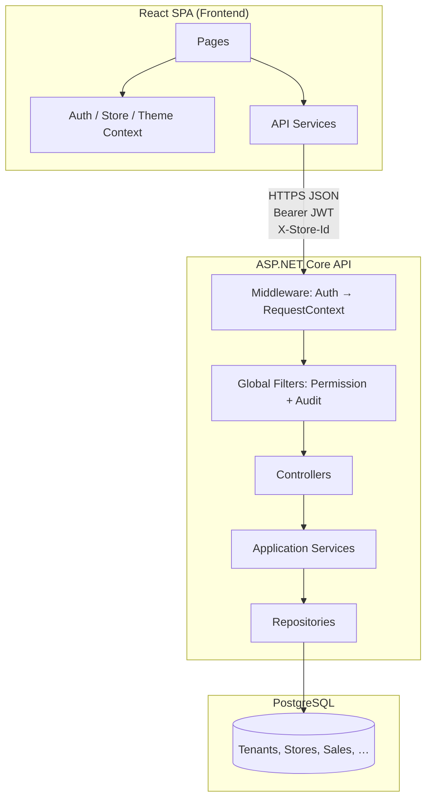

# Architecture Overview

## What StockDaddy is

StockDaddy is a **multi-tenant retail management platform** with:

- Product catalog and variants (barcode, HSN tax codes)
- Inventory and stock alerts
- Point-of-sale (POS) checkout
- Purchase orders and supplier management
- Credit / receivables tracking
- Wholesale (B2B) companies
- Multi-store operations with per-store roles
- Role-based access control (RBAC)
- Activity audit logging

---

## Tech stack

| Layer | Technology | Why |
|-------|------------|-----|
| **Frontend** | React 19, TypeScript, Vite 6 | Fast dev server, type safety, component model familiar to most web devs |
| **UI** | Tailwind CSS, Radix UI (shadcn-style) | Accessible primitives + utility styling; dark/light theme via CSS variables |
| **HTTP** | Axios | Interceptors for JWT and global 401/403 handling |
| **Routing** | React Router 7 | Declarative routes with nested layout + permission guards |
| **Backend** | ASP.NET Core (.NET 9) | Mature web API, built-in DI, JWT, EF Core integration |
| **ORM** | Entity Framework Core 9 | Code-first migrations, LINQ queries, PostgreSQL provider |
| **Database** | PostgreSQL | Relational data, JSON columns for audit payloads |
| **Auth** | JWT (HMAC-SHA256) | Stateless API auth; permissions embedded as claims |

---

## High-level diagram



---

## Backend layered architecture

The backend lives in one project (`StockDaddy.API`) but follows **clean architecture folders**:

```
StockDaddy.API/
├── Domain/           ← Entities + enums (no framework dependencies)
├── Application/      ← DTOs, interfaces, services, authorization helpers
├── Infrastructure/   ← EF Core DbContext, repositories, migrations
├── Controllers/      ← HTTP endpoints (thin layer)
└── Program.cs        ← Composition root (DI + middleware)
```

### Why this structure?

| Layer | Responsibility | Depends on |
|-------|----------------|------------|
| **Domain** | Business nouns: User, Sale, Store | Nothing |
| **Application** | Business rules, orchestration, DTO mapping | Domain |
| **Infrastructure** | Database, external I/O | Application + Domain |
| **Controllers** | HTTP translation (JSON in/out) | Application |

This keeps **database details out of controllers** and **HTTP details out of repositories**.

---

## Frontend architecture

```
Frontend/src/
├── pages/           ← One screen per route (orchestration)
├── components/      ← Reusable UI
│   ├── layout/      ← Shell, sidebar, route guards
│   ├── common/      ← App-specific tables, filters, gates
│   ├── ui/          ← Low-level Radix/shadcn primitives
│   └── access-control/
├── context/         ← Global React state (auth, store, theme)
├── services/        ← HTTP calls (one file per domain)
├── dtos/            ← TypeScript types matching API
├── hooks/           ← Shared React logic
└── config/          ← Static configuration (permissions, features)
```

### Data flow (typical page)

```
Page component
  → useAuth() / useActiveStoreId() / usePagedList()
  → domainService.getPaged({ storeId, ... })
  → apiClient (adds JWT + X-Store-Id)
  → Backend controller
  → Repository (filters by tenant + store)
  → PostgreSQL
```

---

## Multi-tenancy and multi-store

### Tenant

A **tenant** is an organization (business). Almost every table has `TenantId`.

### Store

A **store** is a branch/location within a tenant. Many operational tables also have `StoreId`:

- Customers, suppliers, companies
- Sales, credit ledger entries
- Audit logs (when applicable)

### User access model

```
User
├── RoleId          ← Profile role (stored on Users table)
├── StoreId         ← Login / default store
└── UserStores[]    ← Explicit store assignments
      ├── StoreId
      ├── RoleId    ← Effective role while that store is active
      └── IsDefault ← Which store to open on login
```

**Admin** or users with `Settings:AccessAllStores` can see all stores in their tenant.

---

## Request lifecycle (authenticated API call)

1. **Browser** sends request with `Authorization: Bearer <JWT>` and `X-Store-Id: <id>`
2. **JWT middleware** validates token, populates `HttpContext.User` claims
3. **RequestContextMiddleware** resolves:
   - Allowed stores for this user
   - Active store (header → JWT → default assignment)
4. **PermissionAuthorizationFilter** checks required `Module:Action` claim
5. **Controller action** runs
6. **ActivityAuditFilter** (POST/PUT/PATCH/DELETE) writes audit log
7. **Repository** applies `TenantId` / `StoreId` filters via `QueryScope`
8. **JSON response** returned to frontend

---

## RBAC model

Permissions are strings: **`Module:Action`**

Examples:
- `Sales:Read`
- `Sales:Write`
- `Settings:AccessAllStores`

| Action | Typical HTTP mapping |
|--------|---------------------|
| Read | GET |
| Write | POST |
| Update | PUT, PATCH |
| Delete | DELETE |

Roles are collections of permissions. Users get permissions from:
1. **Effective role for active store** (from `UserStores.RoleId`), or
2. **Profile role** (`Users.RoleId`) as fallback

---

## Key design decisions

| Decision | Rationale |
|----------|-----------|
| Monolithic API (not microservices) | Simpler deployment and transactions for a single product team |
| JWT with permission claims | Avoid DB permission lookup on every request |
| `X-Store-Id` header | Store can switch without re-login; backend validates access |
| Soft delete (`IsDeleted`) | Preserve history; audit-friendly |
| OrchestrationService | Multi-entity workflows (checkout, PO receive) in one DB transaction |
| Paged list pattern | Consistent search/sort/filter across all list screens |
| Feature flags (`FEATURES`) | Optional modules (e.g. bill adjustment) without separate builds |

---

## External integration readiness

The frontend auth layer is isolated in `auth.service.ts` and `AuthContext` so a future **AWS Cognito** migration would mainly change token acquisition, not every page component.

Audit logs and integration events tables support future webhook / event-driven extensions.
