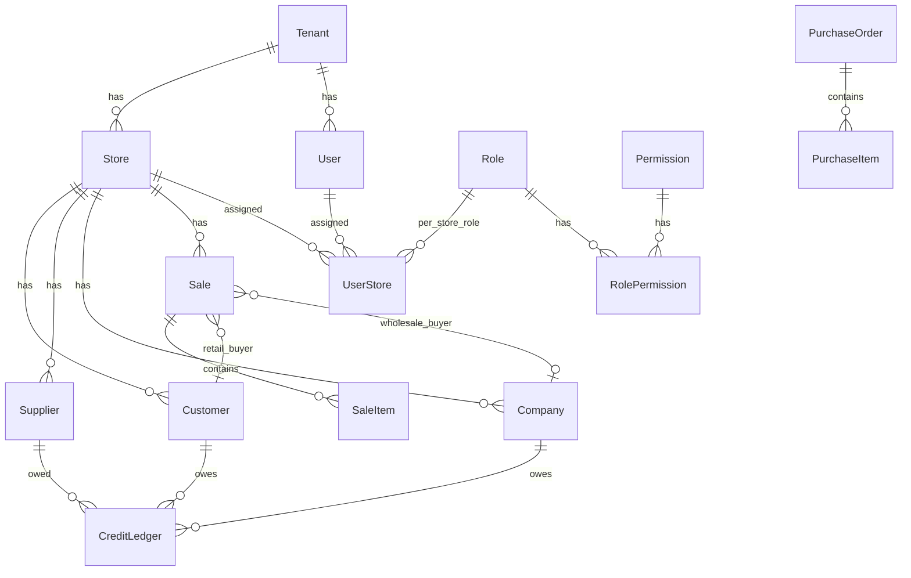

# Database Schema Reference

PostgreSQL database managed by **Entity Framework Core** migrations.

**Conventions used across most tables:**
- `Id` — primary key (auto-increment `integer`, except where noted)
- `CreatedAt`, `UpdatedAt` — UTC timestamps
- `IsDeleted`, `DeletedAt` — soft delete pattern
- `TenantId` — multi-tenant isolation
- `StoreId` — store-scoped data (where applicable)

---

## Entity relationship overview

---

## Core identity & access

### `Tenants`

| Column | Type | Description |
|--------|------|-------------|
| Id | int PK | Organization ID |
| Name | string | Business name |
| CreatedAt, UpdatedAt | datetime | Audit |
| IsDeleted, DeletedAt | bool?, datetime? | Soft delete |

### `Stores`

| Column | Type | Description |
|--------|------|-------------|
| Id | int PK | Store/branch ID |
| TenantId | int FK → Tenants | Owning tenant |
| Name | string | Store name |
| Location | string? | City/address label |
| CreatedAt, UpdatedAt, IsDeleted, DeletedAt | | Audit / soft delete |

### `Users`

| Column | Type | Description |
|--------|------|-------------|
| Id | int PK | User ID |
| TenantId | int FK → Tenants | Tenant membership |
| RoleId | int FK → Roles | Profile/default role |
| StoreId | int? FK → Stores | Login store / legacy default |
| Username | string | Login name |
| Email | string | Email |
| PasswordHash | string | BCrypt/hash (never returned to API) |
| CreatedAt, UpdatedAt, IsDeleted, DeletedAt | | Audit / soft delete |

### `UserStores` (composite PK: UserId + StoreId)

| Column | Type | Description |
|--------|------|-------------|
| UserId | int FK → Users | User |
| StoreId | int FK → Stores | Allowed store |
| RoleId | int FK → Roles | Role when this store is active |
| IsDefault | bool | Login store flag |

### `Roles`

| Column | Type | Description |
|--------|------|-------------|
| Id | int PK | Role ID |
| Name | string | Admin, Manager, Cashier, … |
| CreatedAt, UpdatedAt, IsDeleted, DeletedAt | | Audit / soft delete |

### `Permissions`

| Column | Type | Description |
|--------|------|-------------|
| Id | int PK | Permission ID |
| Module | string | e.g. Sales, Product, Settings |
| Action | enum PermissionAction | Read, Write, Update, Delete, AccessAllStores |
| CreatedAt, UpdatedAt, IsDeleted, DeletedAt | | Audit / soft delete |

**Unique logical key:** `Module` + `Action` → formatted as `Sales:Read` in JWT claims.

### `RolePermissions`

| Column | Type | Description |
|--------|------|-------------|
| Id | int PK | Mapping ID |
| RoleId | int FK → Roles | Role |
| PermissionId | int FK → Permissions | Permission |
| CreatedAt, UpdatedAt, IsDeleted, DeletedAt | | Audit / soft delete |

---

## Catalog & products

### `Categories`

| Column | Type | Description |
|--------|------|-------------|
| Id | int PK | |
| StoreId | int FK → Stores | Store-scoped catalog |
| TenantId | int FK → Tenants | |
| Name | string | Category name |

### `Subcategories`

| Column | Type | Description |
|--------|------|-------------|
| Id | int PK | |
| CategoryId | int FK → Categories | Parent category |
| StoreId, TenantId | int | Scope |
| Name | string | |

### `Products`

| Column | Type | Description |
|--------|------|-------------|
| Id | int PK | |
| TenantId | int | |
| StoreId | int? | Optional store scope |
| SubcategoryId | int? FK | Classification |
| Name | string | Product name |
| Description | string? | |
| Unit | string? | e.g. pcs, kg |

### `ProductVariants`

| Column | Type | Description |
|--------|------|-------------|
| Id | int PK | |
| ProductId | int FK → Products | Parent product |
| StoreId | int FK → Stores | Store-specific SKU |
| HSNCodeId | int? FK → HSNMasters | Tax code |
| VariantName | string | e.g. "500g", "Red / L" |
| Barcode | string? | Scannable code |
| SkuCode | string? | Internal SKU |
| CostPrice | decimal | Purchase cost |
| MarginPercent | decimal | Markup |
| TaxPercent | decimal | Tax rate |
| Price | decimal | Selling price |
| Quantity | int | On-hand qty (also tracked in StockItems) |

### `HSNMasters` / `HsnMaster`

| Column | Type | Description |
|--------|------|-------------|
| Id | int PK | |
| HSNCode | string UNIQUE | Indian HSN code |
| Description | string? | |
| CGSTPercent, SGSTPercent | decimal | Tax components |

### `ProductTags`, `ProductImages`, `ProductAttributes`

Supporting product metadata — each links to `ProductId` with tag text, image URL, or attribute name/value.

### `TaxRegions`

| Column | Type | Description |
|--------|------|-------------|
| Id | int PK | |
| TenantId, StoreId? | int | Scope |
| RegionName | string | |
| TaxPercent | decimal | Regional tax override |

---

## Inventory

### `StockItems`

| Column | Type | Description |
|--------|------|-------------|
| Id | int PK | |
| ProductId | int FK → Products | |
| StoreId | int? FK → Stores | |
| Quantity | int | Current stock |
| Status | enum StockStatus | InStock, Low, OutOfStock, Discontinued |
| LastUpdated | datetime | |
| UpdatedBy | int? FK → Users | |

### `ProductRestockAlerts`

Triggered when stock falls below threshold — links Product, Store, Variant, status string.

### `ScheduledPriceReverts`

Background job table for temporary price changes — stores JSON of original prices and revert timestamp.

---

## Parties (customers, suppliers, companies)

### `Customers`

| Column | Type | Description |
|--------|------|-------------|
| Id | int PK | |
| TenantId | int | |
| **StoreId** | int FK → Stores | **Store-scoped** |
| Name, Phone, Email, Address | string? | Contact info |

### `Suppliers`

Same shape as Customers — store-scoped vendor records.

### `Companies` (B2B wholesale buyers)

| Column | Type | Description |
|--------|------|-------------|
| Id | int PK | |
| TenantId | int | |
| **StoreId** | int FK → Stores | **Store-scoped** |
| Name, ContactName, Phone, Email, Address | string? | |
| Gstin | string? | GST registration number |

---

## Sales & billing

### `Sales`

| Column | Type | Description |
|--------|------|-------------|
| Id | int PK | |
| TenantId | int | |
| StoreId | int? FK → Stores | Where sale occurred |
| CustomerId | int? FK → Customers | Retail buyer |
| CompanyId | int? FK → Companies | Wholesale buyer |
| SoldBy | int FK → Users | Cashier/user |
| SubtotalAmount | decimal | Before tax/discount |
| TaxAmount | decimal | |
| DiscountAmount | decimal | |
| TotalAmount | decimal | Final total |
| PaymentMethod | enum | Cash, Card, UPI, BankTransfer, Credit |
| Notes | string? | |
| CreatedAt, UpdatedAt, IsDeleted, DeletedAt | | |

### `SaleItems`

| Column | Type | Description |
|--------|------|-------------|
| Id | int PK | |
| SaleId | int FK → Sales | |
| ProductVariantId | int FK → ProductVariants | |
| Quantity | int | |
| UnitPrice | decimal | Price at time of sale |
| TotalPrice | decimal | Line total |

### `Invoices`, `Payments`, `Returns`, `Refunds`, `Shipments`, `GiftOptions`

Standard billing workflow tables linked to `SaleId` / `InvoiceId`. See entity files in `Domain/Entities/` for full columns.

### `BundleSaleItems`, `ProductBundles`, `BundleItems`

Support for selling product bundles (multiple products as one SKU).

---

## Purchasing

### `PurchaseOrders`

| Column | Type | Description |
|--------|------|-------------|
| Id | int PK | |
| TenantId | int | |
| SupplierId | int FK → Suppliers | |
| StoreId | int FK → Stores | Receiving store |
| OrderDate, ExpectedDelivery | datetime | |
| Status | enum PurchaseOrderStatus | |
| TotalAmount | decimal | |
| DueDate | datetime? | Payment due |
| FullyReceived | bool | All items received |
| Notes | string? | |

### `PurchaseItems`

| Column | Type | Description |
|--------|------|-------------|
| Id | int PK | |
| PurchaseOrderId | int FK | |
| ProductVariantId | int FK | |
| Quantity | int | Ordered qty |
| **QuantityReceived** | int? | Received qty (partial receive support) |
| UnitCost, TotalCost | decimal | |

---

## Credit & audit

### `CreditLedgers`

| Column | Type | Description |
|--------|------|-------------|
| Id | int PK | |
| TenantId | int | |
| **StoreId** | int FK → Stores | **Store-scoped** |
| PartyType | enum | Customer, Supplier, Company |
| Status | enum CreditStatus | Pending, PartiallyPaid, Paid, Overdue |
| CustomerId / SupplierId / CompanyId | int? FK | Party reference (one set per row) |
| SaleId / PurchaseOrderId | int? FK | Source transaction |
| PartyName, PartyPhone, PartyEmail, PartyAddress | string? | Denormalized snapshot |
| Amount | decimal | Original credit amount |
| AmountPaid | decimal | Payments applied |
| DueDate | datetime? | |
| Notes | string? | |

### `AuditLogs`

| Column | Type | Description |
|--------|------|-------------|
| Id | int PK | |
| UserId | int? FK → Users | Who performed action |
| StoreId | int? FK → Stores | Active store context |
| Action | string | HTTP method or action name |
| TableName | string | Affected entity |
| RecordId | string | Affected record ID |
| OldData, NewData | string (JSON) | Change payload |
| Timestamp | datetime | When |

---

## Enums reference

| Enum | Values |
|------|--------|
| **PermissionAction** | Read, Write, Update, Delete, AccessAllStores |
| **PaymentMethod** | Cash, Card, UPI, BankTransfer, Credit |
| **StockStatus** | InStock, Low, OutOfStock, Discontinued |
| **CreditStatus** | Pending, PartiallyPaid, Paid, Overdue |
| **CreditPartyType** | Customer, Supplier, Company |
| **SaleBuyerType** | Retail, Wholesale (DTO/orchestration only) |
| **PurchaseOrderStatus** | Pending, Paid, Unpaid, Overdue, Cancelled, Delivered, Failed |
| **InvoiceStatus** | (same set as PO status) |
| **ShipmentStatus** | (same set as PO status) |

---

## Migrations history

| Migration | Purpose |
|-----------|---------|
| `AddScheduledPriceRevertTable` | Initial schema (all core tables) |
| `AddCreditLedgerCheckoutSchema` | Credit ledger + sale amount breakdown |
| `AddPurchaseItemQuantityReceived` | Partial PO receiving |
| `AddWholesaleCompanies` | Companies table + Sale.CompanyId |
| `AddUserStores` | Multi-store user assignments |
| `AddStoreScopeToParties` | StoreId on customers, suppliers, companies, credit |
| `AddRoleIdToUserStores` | Per-store role on UserStores |

---

## Data scoping rules

| Data type | Filtered by |
|-----------|-------------|
| Tenant-wide config | `TenantId` |
| Store operations | `TenantId` + `StoreId` (via `QueryScope`) |
| RBAC | JWT permission claims + active store role |
| Admin / AccessAllStores | Can query all stores in tenant |

See [BACKEND.md](./BACKEND.md) for `QueryScope` and `RequestContext` implementation details.
