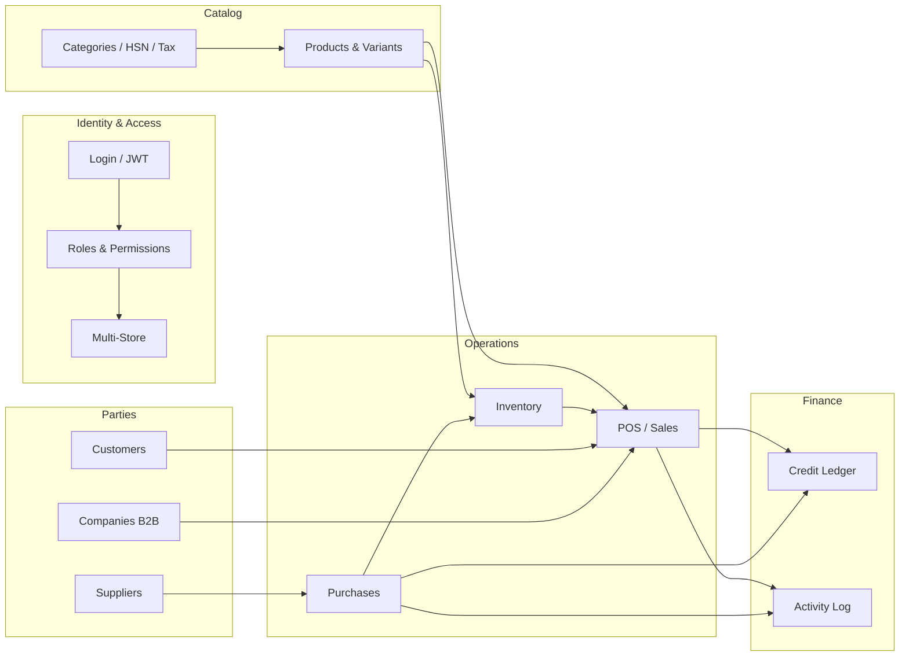

# Features and Interconnections

This document explains **each major feature**, which UI screens and API endpoints it uses, which database tables it touches, and **how features connect to each other**.

---

## Feature map (overview)



---

## 1. Authentication & session

### What it does

Users log in with username/email + password. Backend returns JWT + user profile including permissions and store assignments.

### UI

- `LoginPage`, `RegisterPage`
- `AuthContext` holds session globally

### API

| Endpoint | Purpose |
|----------|---------|
| POST `/api/auth/login` | Authenticate |
| POST `/api/auth/register` | Create account |
| GET `/api/auth/me` | Validate/refresh session |
| GET `/api/auth/me/stores` | List allowed stores |
| POST `/api/auth/switch-store` | Change active store + re-issue JWT |

### Tables

- `Users`, `Roles`, `UserStores`, `Stores`, `Tenants`

### Connects to

Everything — all protected routes require JWT. Permissions in JWT control which pages/actions are visible.

---

## 2. Multi-store context

### What it does

Users may access one or more stores. Active store determines which data they see and which role permissions apply.

### UI

- Header store dropdown (`Header.tsx`)
- `StoreContext` — active store state
- Pages pass `storeId` to API queries
- `stockdaddy:store-changed` event reloads store-scoped pages

### API

- Every request sends `X-Store-Id` header (from `api.client.ts`)
- `RequestContextMiddleware` validates store access

### Tables

- `UserStores` (UserId, StoreId, RoleId, IsDefault)
- `Stores`, `Users`

### Connects to

- **Customers, suppliers, companies, credit, activity** — filtered by store
- **RBAC** — effective role changes per store
- **POS** — inventory and sales scoped to active store

---

## 3. Access control (RBAC)

### What it does

Admins define roles (Admin, Manager, Cashier) and assign module permissions. Users get permissions via role — **per store** when store assignments exist.

### UI

| Tab | Purpose |
|-----|---------|
| Roles | Create/rename/delete roles |
| Role Permissions | Matrix: module × Read/Write/Update/Delete + Access All Stores |
| Store & User Access | Per-user store assignments with role per store |

Components: `RolesTab`, `StoreRoleAssignmentsEditor`, `PermissionGate`

### API

| Endpoint | Purpose |
|----------|---------|
| GET `/api/rbac/matrix` | Full permission matrix |
| PUT `/api/rbac/roles/{id}/permissions` | Save role permissions |
| PUT `/api/rbac/users/{id}/store-assignments` | Save store + role assignments |

### Tables

- `Roles`, `Permissions`, `RolePermissions`, `UserStores`, `Users`

### Connects to

- **Every module** — backend filter blocks unauthorized API calls
- **Sidebar** — hides nav items without Read permission
- **Settings:AccessAllStores** — allows cross-store management

---

## 4. Catalog (categories, HSN, tax regions)

### What it does

Organizes products: categories → subcategories, HSN tax codes, regional tax overrides.

### UI

- `CatalogPage` with tabs: `CategoriesTab`, `SubcategoriesTab`, `HsnTab`, `TaxRegionsTab`

### API

- `/api/category`, `/api/subcategory`, `/api/hsnmaster`, `/api/taxregion`

### Tables

- `Categories`, `Subcategories`, `HSNMasters`, `TaxRegions`

### Connects to

- **Products** — products link to subcategory and HSN on variants
- **Sales checkout** — tax calculated from variant tax/HSN

---

## 5. Products & variants

### What it does

Manage sellable items. Each product can have multiple variants (size/color) with barcode, SKU, price, cost.

### UI

- `ProductsPage` — product + variant CRUD
- `VariantSelect` component used in other modules

### API

- `/api/product`, `/api/productvariant`
- POST `/api/orchestration/product-with-variant` — atomic create with stock

### Tables

- `Products`, `ProductVariants`, `ProductTags`, `ProductImages`, `ProductAttributes`

### Connects to

- **Inventory** — stock tracked per variant
- **Sales POS** — cart adds variants
- **Purchases** — PO line items reference variants

---

## 6. Inventory

### What it does

Track stock levels, low-stock alerts, manual stock adjustments.

### UI

- `InventoryPage` — stock list, alerts, adjust stock modal

### API

- `/api/stockitem`, `/api/productrestockalert`
- POST `/api/orchestration/adjust-stock`

### Tables

- `StockItems`, `ProductRestockAlerts`, `ProductVariants`

### Connects to

- **Dashboard** — low stock widgets
- **Sales checkout** — decrements stock
- **Purchase receive** — increments stock

---

## 7. Sales & POS

### What it does

Full point-of-sale: scan barcode, build cart, retail or wholesale buyer, payment methods, discounts, credit sales.

### UI

- `SalesPage` — cart + checkout + sales history tabs

### Flow

```
Select buyer type (Retail / Wholesale)
  → Pick or create customer OR company
  → Add variants (dropdown or barcode)
  → Set payment method, discount, credit due date
  → orchestrationService.checkout()
  → Sale + SaleItems + stock update + CreditLedger (if credit)
```

### API

- GET `/api/orchestration/variant-stock?storeId=`
- GET `/api/orchestration/variant-by-barcode?code=&storeId=`
- POST `/api/orchestration/checkout`
- GET `/api/sale` (paged history)

### Tables

- `Sales`, `SaleItems`, `ProductVariants`, `StockItems`
- `Customers` or `Companies` (buyer)
- `CreditLedgers` (if payment method = Credit)

### Connects to

- **Customers / Companies** — buyer records
- **Credit reminders** — credit sales create ledger entries
- **Activity log** — checkout audited
- **Inventory** — stock decremented

---

## 8. Customers

### What it does

CRM for retail buyers — contact info, sales history.

### UI

- `CustomersPage` — CRUD + sales history modal

### API

- `/api/customer`, GET `/api/customer/{id}/sales`

### Tables

- `Customers` (store-scoped)

### Connects to

- **Sales POS** — retail buyer selection
- **Credit** — customer receivables

---

## 9. Companies (B2B wholesale)

### What it does

Manage wholesale business buyers with GSTIN. Used when `buyerType = Wholesale` at POS.

### UI

- `CompaniesPage` — CRUD
- `SalesPage` — company picker at checkout

### API

- `/api/company`, GET `/api/company/{id}/sales`

### Tables

- `Companies` (store-scoped)
- `Sales.CompanyId`

### Connects to

- **Sales POS** — wholesale checkout
- **Credit** — company receivables (`CreditPartyType.Company`)

---

## 10. Suppliers & purchases

### What it does

Manage vendors and purchase orders. Receive goods partially or fully — updates inventory.

### UI

- `SuppliersPage` — supplier CRUD
- `PurchasesPage` — PO create/edit/receive

### Flow (receive)

```
Create PO with line items
  → POST /orchestration/purchase-order-with-items
Receive goods
  → POST /orchestration/purchase-order/{id}/receive
  → Updates QuantityReceived, increases stock, sets FullyReceived
```

### Tables

- `Suppliers`, `PurchaseOrders`, `PurchaseItems`, `StockItems`

### Connects to

- **Inventory** — stock increases on receive
- **Credit** — supplier payables (CreditPartyType.Supplier)

---

## 11. Credit & reminders

### What it does

Track money owed by customers/companies (receivables) or to suppliers (payables). Record partial payments.

### UI

- `CreditRemindersPage` — ledger list, payment recording, filters by party type/status

### API

- GET `/api/creditledger`, POST `/api/creditledger/{id}/payments`

### Tables

- `CreditLedgers` (store-scoped, links to Customer/Supplier/Company/Sale/PO)

### Connects to

- **Sales** — credit payment method creates entry
- **Purchases** — supplier credit
- **Dashboard** — overdue summaries (if implemented)

---

## 12. Activity log

### What it does

Audit trail of create/update/delete operations — who did what, when, in which store.

### UI

- `ActivityPage` — paged audit log with human-readable summaries

### API

- GET `/api/auditlog`

### Tables

- `AuditLogs`

### Connects to

- **All write operations** — `ActivityAuditFilter` auto-logs
- **Store context** — entries tagged with active store
- **Permissions** — `Activity:Read` sees store activity; without it users see only own entries

---

## 13. User management

### What it does

CRUD for staff users within tenant. Assign profile role + store access with per-store roles.

### UI

- `UsersPage` — user list, create/edit modals with `StoreRoleAssignmentsEditor`

### API

- `/api/user`

### Connects to

- **Access control** — complementary; Access Control tab focuses on store assignments for all users in store context

---

## 14. Settings

### What it does

- Manage store locations (CRUD)
- Theme preference (light/dark/system)
- Display auth/tenant info

### UI

- `SettingsPage`

### API

- `/api/store`

---

## 15. Dashboard

### What it does

Overview: revenue, recent sales, low stock, restock alerts.

### UI

- `DashboardPage`

### API

- orchestration variant stock, sale paged, restock alerts — all filtered by active store

---

## 16. Theme (UI)

### What it does

Light, dark, or system appearance. CSS variables + Tailwind dark mode.

### UI

- `ThemeContext`, Settings appearance cards, `theme-init.js`

No backend — purely frontend localStorage.

---

## 17. Bill adjustment (optional)

### What it does

Hidden admin tool to adjust or void completed sales (feature-flagged).

### UI

- `BillAdjustmentPage` at secret path

### API

- PUT/DELETE `/api/bill-adjustment/{saleId}`

Controlled by `FEATURES.billAdjustment` in frontend and backend feature options.

---

## Cross-cutting: paged list pattern

Almost every list page uses the same pattern:

```
usePagedList({ fetchFn: (query) => service.getPaged({ ...query, storeId }) })
  → PagedDataTable with columns, search, sort, filters
  → ListFilterBar with FilterSelect options from config/list-filters.ts
```

This keeps UX consistent and ensures store scoping is applied uniformly.

---

## Cross-cutting: permission enforcement chain

```
User logs in
  → JWT contains permission claims for effective store role
  → Sidebar shows allowed modules
  → PermissionRoute blocks page access
  → PermissionGate hides action buttons
  → API PermissionAuthorizationFilter returns 403 if claim missing
  → Toast shows "Access Denied" on 403
```

---

## Default seeded data (first run)

| Item | Value |
|------|-------|
| Tenant | Default Tenant |
| Store | Main Store |
| Admin user | admin / Admin@123 |
| Roles | Admin, Manager, Cashier |

Use this to explore all features locally after `dotnet ef database update` and `npm run dev`.
