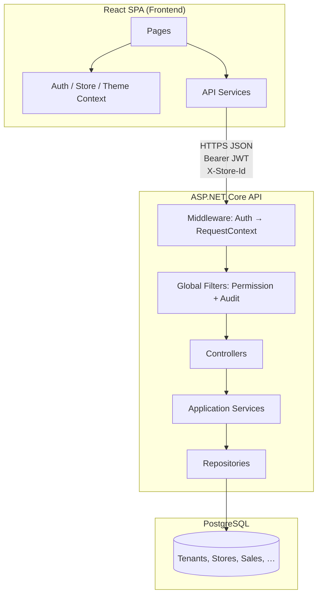
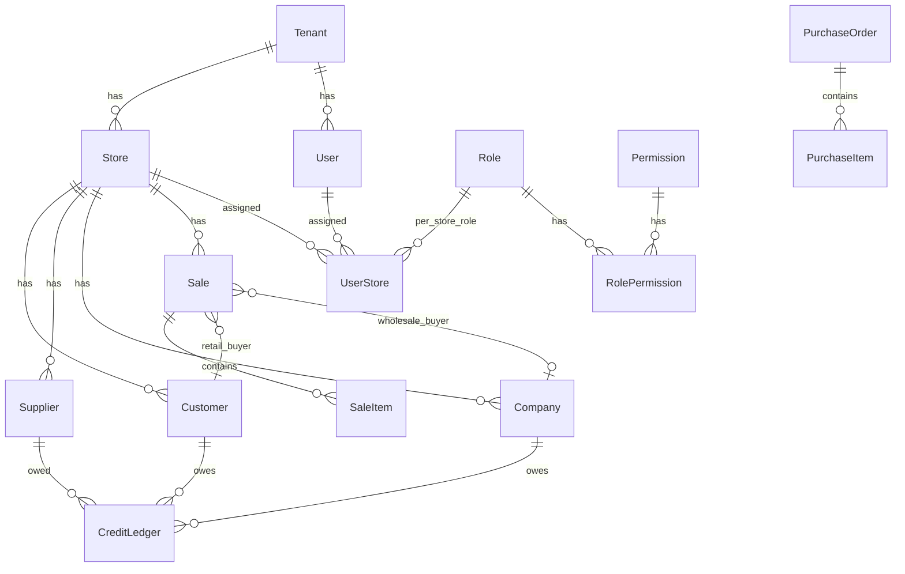
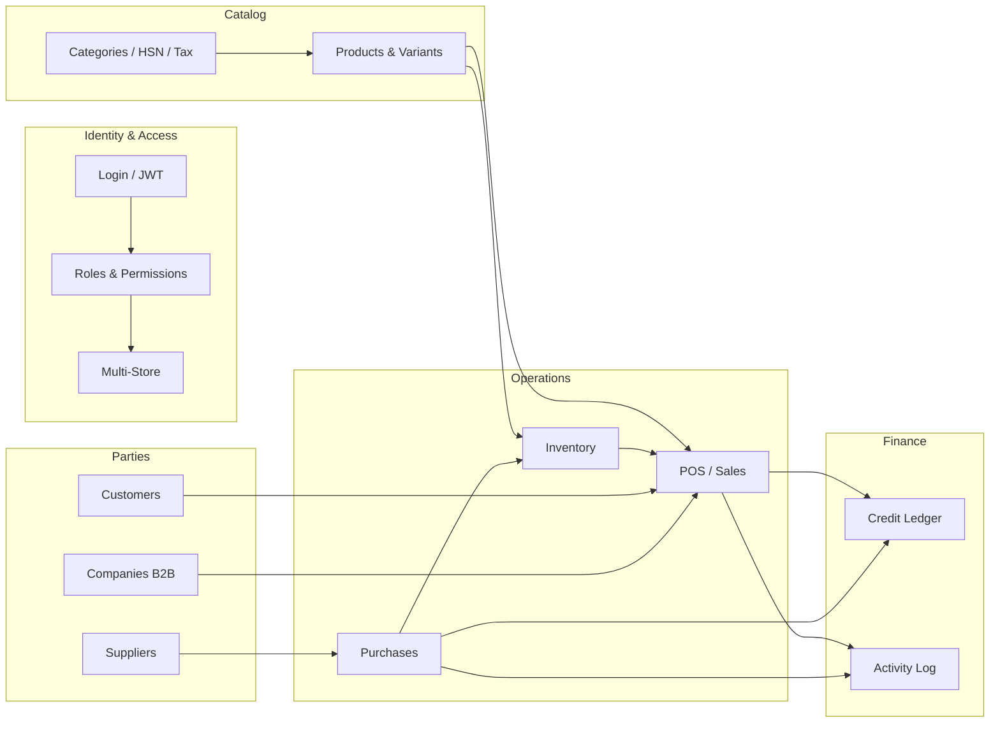

# StockDaddy — Complete Guide

One document for architecture, codebase, production builds, interview prep, and CI/CD learning.

**Local dev:** Backend `dotnet run` in `Backend/StockDaddy.API` · Frontend `npm run dev` in `Frontend` · Login `admin` / `Admin@123`

---

## Table of contents

1. [Architecture](#architecture-overview)
2. [Database schema](#database-schema-reference)
3. [Backend](#backend-reference)
4. [Frontend](#frontend-reference)
5. [Features & flows](#features-and-interconnections)
6. [Production build](#production-build-guide)
7. [Project journey](#project-journey--built-from-the-ground-up)
8. [Technical glossary](#technical-glossary--interview-vocabulary)
9. [LINQ, EF & SQL](#linq-entity-framework--sql--learn-from-this-codebase)
10. [React patterns](#react--typescript-patterns-in-stockdaddy)
11. [Clean code](#clean-code-guide--stockdaddy-conventions)
12. [Learning guide](#learning-guide--how-to-read-this-codebase)
13. [Code walkthrough](#code-walkthrough--line-by-line)
14. [Interview questions](#interview-questions--stockdaddy-stack)
15. [CI/CD roadmap](#cicd-learning-roadmap-next-module)

---


---


# Architecture Overview

## What StockDaddy is

StockDaddy is a **multi-tenant retail management platform** with:

- Product catalog and variants (barcode, HSN tax codes)
- Inventory and stock alerts
- Point-of-sale (POS) checkout
- Purchase orders and supplier management
- Credit / receivables tracking
- Wholesale (B2B) companies
- Multi-store operations with per-store roles
- Role-based access control (RBAC)
- Activity audit logging

---

## Tech stack

| Layer | Technology | Why |
|-------|------------|-----|
| **Frontend** | React 19, TypeScript, Vite 6 | Fast dev server, type safety, component model familiar to most web devs |
| **UI** | Tailwind CSS, Radix UI (shadcn-style) | Accessible primitives + utility styling; dark/light theme via CSS variables |
| **HTTP** | Axios | Interceptors for JWT and global 401/403 handling |
| **Routing** | React Router 7 | Declarative routes with nested layout + permission guards |
| **Backend** | ASP.NET Core (.NET 9) | Mature web API, built-in DI, JWT, EF Core integration |
| **ORM** | Entity Framework Core 9 | Code-first migrations, LINQ queries, PostgreSQL provider |
| **Database** | PostgreSQL | Relational data, JSON columns for audit payloads |
| **Auth** | JWT (HMAC-SHA256) | Stateless API auth; permissions embedded as claims |

---

## High-level diagram



---

## Backend layered architecture

The backend lives in one project (`StockDaddy.API`) but follows **clean architecture folders**:

```
StockDaddy.API/
├── Domain/           ← Entities + enums (no framework dependencies)
├── Application/      ← DTOs, interfaces, services, authorization helpers
├── Infrastructure/   ← EF Core DbContext, repositories, migrations
├── Controllers/      ← HTTP endpoints (thin layer)
└── Program.cs        ← Composition root (DI + middleware)
```

### Why this structure?

| Layer | Responsibility | Depends on |
|-------|----------------|------------|
| **Domain** | Business nouns: User, Sale, Store | Nothing |
| **Application** | Business rules, orchestration, DTO mapping | Domain |
| **Infrastructure** | Database, external I/O | Application + Domain |
| **Controllers** | HTTP translation (JSON in/out) | Application |

This keeps **database details out of controllers** and **HTTP details out of repositories**.

---

## Frontend architecture

```
Frontend/src/
├── pages/           ← One screen per route (orchestration)
├── components/      ← Reusable UI
│   ├── layout/      ← Shell, sidebar, route guards
│   ├── common/      ← App-specific tables, filters, gates
│   ├── ui/          ← Low-level Radix/shadcn primitives
│   └── access-control/
├── context/         ← Global React state (auth, store, theme)
├── services/        ← HTTP calls (one file per domain)
├── dtos/            ← TypeScript types matching API
├── hooks/           ← Shared React logic
└── config/          ← Static configuration (permissions, features)
```

### Data flow (typical page)

```
Page component
  → useAuth() / useActiveStoreId() / usePagedList()
  → domainService.getPaged({ storeId, ... })
  → apiClient (adds JWT + X-Store-Id)
  → Backend controller
  → Repository (filters by tenant + store)
  → PostgreSQL
```

---

## Multi-tenancy and multi-store

### Tenant

A **tenant** is an organization (business). Almost every table has `TenantId`.

### Store

A **store** is a branch/location within a tenant. Many operational tables also have `StoreId`:

- Customers, suppliers, companies
- Sales, credit ledger entries
- Audit logs (when applicable)

### User access model

```
User
├── RoleId          ← Profile role (stored on Users table)
├── StoreId         ← Login / default store
└── UserStores[]    ← Explicit store assignments
      ├── StoreId
      ├── RoleId    ← Effective role while that store is active
      └── IsDefault ← Which store to open on login
```

**Admin** or users with `Settings:AccessAllStores` can see all stores in their tenant.

---

## Request lifecycle (authenticated API call)

1. **Browser** sends request with `Authorization: Bearer <JWT>` and `X-Store-Id: <id>`
2. **JWT middleware** validates token, populates `HttpContext.User` claims
3. **RequestContextMiddleware** resolves:
   - Allowed stores for this user
   - Active store (header → JWT → default assignment)
4. **PermissionAuthorizationFilter** checks required `Module:Action` claim
5. **Controller action** runs
6. **ActivityAuditFilter** (POST/PUT/PATCH/DELETE) writes audit log
7. **Repository** applies `TenantId` / `StoreId` filters via `QueryScope`
8. **JSON response** returned to frontend

---

## RBAC model

Permissions are strings: **`Module:Action`**

Examples:
- `Sales:Read`
- `Sales:Write`
- `Settings:AccessAllStores`

| Action | Typical HTTP mapping |
|--------|---------------------|
| Read | GET |
| Write | POST |
| Update | PUT, PATCH |
| Delete | DELETE |

Roles are collections of permissions. Users get permissions from:
1. **Effective role for active store** (from `UserStores.RoleId`), or
2. **Profile role** (`Users.RoleId`) as fallback

---

## Key design decisions

| Decision | Rationale |
|----------|-----------|
| Monolithic API (not microservices) | Simpler deployment and transactions for a single product team |
| JWT with permission claims | Avoid DB permission lookup on every request |
| `X-Store-Id` header | Store can switch without re-login; backend validates access |
| Soft delete (`IsDeleted`) | Preserve history; audit-friendly |
| OrchestrationService | Multi-entity workflows (checkout, PO receive) in one DB transaction |
| Paged list pattern | Consistent search/sort/filter across all list screens |
| Feature flags (`FEATURES`) | Optional modules (e.g. bill adjustment) without separate builds |

---

## External integration readiness

The frontend auth layer is isolated in `auth.service.ts` and `AuthContext` so a future **AWS Cognito** migration would mainly change token acquisition, not every page component.

Audit logs and integration events tables support future webhook / event-driven extensions.


---


# Database Schema Reference

PostgreSQL database managed by **Entity Framework Core** migrations.

**Conventions used across most tables:**
- `Id` — primary key (auto-increment `integer`, except where noted)
- `CreatedAt`, `UpdatedAt` — UTC timestamps
- `IsDeleted`, `DeletedAt` — soft delete pattern
- `TenantId` — multi-tenant isolation
- `StoreId` — store-scoped data (where applicable)

---

## Entity relationship overview



---

## Core identity & access

### `Tenants`

| Column | Type | Description |
|--------|------|-------------|
| Id | int PK | Organization ID |
| Name | string | Business name |
| CreatedAt, UpdatedAt | datetime | Audit |
| IsDeleted, DeletedAt | bool?, datetime? | Soft delete |

### `Stores`

| Column | Type | Description |
|--------|------|-------------|
| Id | int PK | Store/branch ID |
| TenantId | int FK → Tenants | Owning tenant |
| Name | string | Store name |
| Location | string? | City/address label |
| CreatedAt, UpdatedAt, IsDeleted, DeletedAt | | Audit / soft delete |

### `Users`

| Column | Type | Description |
|--------|------|-------------|
| Id | int PK | User ID |
| TenantId | int FK → Tenants | Tenant membership |
| RoleId | int FK → Roles | Profile/default role |
| StoreId | int? FK → Stores | Login store / legacy default |
| Username | string | Login name |
| Email | string | Email |
| PasswordHash | string | BCrypt/hash (never returned to API) |
| CreatedAt, UpdatedAt, IsDeleted, DeletedAt | | Audit / soft delete |

### `UserStores` (composite PK: UserId + StoreId)

| Column | Type | Description |
|--------|------|-------------|
| UserId | int FK → Users | User |
| StoreId | int FK → Stores | Allowed store |
| RoleId | int FK → Roles | Role when this store is active |
| IsDefault | bool | Login store flag |

### `Roles`

| Column | Type | Description |
|--------|------|-------------|
| Id | int PK | Role ID |
| Name | string | Admin, Manager, Cashier, … |
| CreatedAt, UpdatedAt, IsDeleted, DeletedAt | | Audit / soft delete |

### `Permissions`

| Column | Type | Description |
|--------|------|-------------|
| Id | int PK | Permission ID |
| Module | string | e.g. Sales, Product, Settings |
| Action | enum PermissionAction | Read, Write, Update, Delete, AccessAllStores |
| CreatedAt, UpdatedAt, IsDeleted, DeletedAt | | Audit / soft delete |

**Unique logical key:** `Module` + `Action` → formatted as `Sales:Read` in JWT claims.

### `RolePermissions`

| Column | Type | Description |
|--------|------|-------------|
| Id | int PK | Mapping ID |
| RoleId | int FK → Roles | Role |
| PermissionId | int FK → Permissions | Permission |
| CreatedAt, UpdatedAt, IsDeleted, DeletedAt | | Audit / soft delete |

---

## Catalog & products

### `Categories`

| Column | Type | Description |
|--------|------|-------------|
| Id | int PK | |
| StoreId | int FK → Stores | Store-scoped catalog |
| TenantId | int FK → Tenants | |
| Name | string | Category name |

### `Subcategories`

| Column | Type | Description |
|--------|------|-------------|
| Id | int PK | |
| CategoryId | int FK → Categories | Parent category |
| StoreId, TenantId | int | Scope |
| Name | string | |

### `Products`

| Column | Type | Description |
|--------|------|-------------|
| Id | int PK | |
| TenantId | int | |
| StoreId | int? | Optional store scope |
| SubcategoryId | int? FK | Classification |
| Name | string | Product name |
| Description | string? | |
| Unit | string? | e.g. pcs, kg |

### `ProductVariants`

| Column | Type | Description |
|--------|------|-------------|
| Id | int PK | |
| ProductId | int FK → Products | Parent product |
| StoreId | int FK → Stores | Store-specific SKU |
| HSNCodeId | int? FK → HSNMasters | Tax code |
| VariantName | string | e.g. "500g", "Red / L" |
| Barcode | string? | Scannable code |
| SkuCode | string? | Internal SKU |
| CostPrice | decimal | Purchase cost |
| MarginPercent | decimal | Markup |
| TaxPercent | decimal | Tax rate |
| Price | decimal | Selling price |
| Quantity | int | On-hand qty (also tracked in StockItems) |

### `HSNMasters` / `HsnMaster`

| Column | Type | Description |
|--------|------|-------------|
| Id | int PK | |
| HSNCode | string UNIQUE | Indian HSN code |
| Description | string? | |
| CGSTPercent, SGSTPercent | decimal | Tax components |

### `ProductTags`, `ProductImages`, `ProductAttributes`

Supporting product metadata — each links to `ProductId` with tag text, image URL, or attribute name/value.

### `TaxRegions`

| Column | Type | Description |
|--------|------|-------------|
| Id | int PK | |
| TenantId, StoreId? | int | Scope |
| RegionName | string | |
| TaxPercent | decimal | Regional tax override |

---

## Inventory

### `StockItems`

| Column | Type | Description |
|--------|------|-------------|
| Id | int PK | |
| ProductId | int FK → Products | |
| StoreId | int? FK → Stores | |
| Quantity | int | Current stock |
| Status | enum StockStatus | InStock, Low, OutOfStock, Discontinued |
| LastUpdated | datetime | |
| UpdatedBy | int? FK → Users | |

### `ProductRestockAlerts`

Triggered when stock falls below threshold — links Product, Store, Variant, status string.

### `ScheduledPriceReverts`

Background job table for temporary price changes — stores JSON of original prices and revert timestamp.

---

## Parties (customers, suppliers, companies)

### `Customers`

| Column | Type | Description |
|--------|------|-------------|
| Id | int PK | |
| TenantId | int | |
| **StoreId** | int FK → Stores | **Store-scoped** |
| Name, Phone, Email, Address | string? | Contact info |

### `Suppliers`

Same shape as Customers — store-scoped vendor records.

### `Companies` (B2B wholesale buyers)

| Column | Type | Description |
|--------|------|-------------|
| Id | int PK | |
| TenantId | int | |
| **StoreId** | int FK → Stores | **Store-scoped** |
| Name, ContactName, Phone, Email, Address | string? | |
| Gstin | string? | GST registration number |

---

## Sales & billing

### `Sales`

| Column | Type | Description |
|--------|------|-------------|
| Id | int PK | |
| TenantId | int | |
| StoreId | int? FK → Stores | Where sale occurred |
| CustomerId | int? FK → Customers | Retail buyer |
| CompanyId | int? FK → Companies | Wholesale buyer |
| SoldBy | int FK → Users | Cashier/user |
| SubtotalAmount | decimal | Before tax/discount |
| TaxAmount | decimal | |
| DiscountAmount | decimal | |
| TotalAmount | decimal | Final total |
| PaymentMethod | enum | Cash, Card, UPI, BankTransfer, Credit |
| Notes | string? | |
| CreatedAt, UpdatedAt, IsDeleted, DeletedAt | | |

### `SaleItems`

| Column | Type | Description |
|--------|------|-------------|
| Id | int PK | |
| SaleId | int FK → Sales | |
| ProductVariantId | int FK → ProductVariants | |
| Quantity | int | |
| UnitPrice | decimal | Price at time of sale |
| TotalPrice | decimal | Line total |

### `Invoices`, `Payments`, `Returns`, `Refunds`, `Shipments`, `GiftOptions`

Standard billing workflow tables linked to `SaleId` / `InvoiceId`. See entity files in `Domain/Entities/` for full columns.

### `BundleSaleItems`, `ProductBundles`, `BundleItems`

Support for selling product bundles (multiple products as one SKU).

---

## Purchasing

### `PurchaseOrders`

| Column | Type | Description |
|--------|------|-------------|
| Id | int PK | |
| TenantId | int | |
| SupplierId | int FK → Suppliers | |
| StoreId | int FK → Stores | Receiving store |
| OrderDate, ExpectedDelivery | datetime | |
| Status | enum PurchaseOrderStatus | |
| TotalAmount | decimal | |
| DueDate | datetime? | Payment due |
| FullyReceived | bool | All items received |
| Notes | string? | |

### `PurchaseItems`

| Column | Type | Description |
|--------|------|-------------|
| Id | int PK | |
| PurchaseOrderId | int FK | |
| ProductVariantId | int FK | |
| Quantity | int | Ordered qty |
| **QuantityReceived** | int? | Received qty (partial receive support) |
| UnitCost, TotalCost | decimal | |

---

## Credit & audit

### `CreditLedgers`

| Column | Type | Description |
|--------|------|-------------|
| Id | int PK | |
| TenantId | int | |
| **StoreId** | int FK → Stores | **Store-scoped** |
| PartyType | enum | Customer, Supplier, Company |
| Status | enum CreditStatus | Pending, PartiallyPaid, Paid, Overdue |
| CustomerId / SupplierId / CompanyId | int? FK | Party reference (one set per row) |
| SaleId / PurchaseOrderId | int? FK | Source transaction |
| PartyName, PartyPhone, PartyEmail, PartyAddress | string? | Denormalized snapshot |
| Amount | decimal | Original credit amount |
| AmountPaid | decimal | Payments applied |
| DueDate | datetime? | |
| Notes | string? | |

### `AuditLogs`

| Column | Type | Description |
|--------|------|-------------|
| Id | int PK | |
| UserId | int? FK → Users | Who performed action |
| StoreId | int? FK → Stores | Active store context |
| Action | string | HTTP method or action name |
| TableName | string | Affected entity |
| RecordId | string | Affected record ID |
| OldData, NewData | string (JSON) | Change payload |
| Timestamp | datetime | When |

---

## Enums reference

| Enum | Values |
|------|--------|
| **PermissionAction** | Read, Write, Update, Delete, AccessAllStores |
| **PaymentMethod** | Cash, Card, UPI, BankTransfer, Credit |
| **StockStatus** | InStock, Low, OutOfStock, Discontinued |
| **CreditStatus** | Pending, PartiallyPaid, Paid, Overdue |
| **CreditPartyType** | Customer, Supplier, Company |
| **SaleBuyerType** | Retail, Wholesale (DTO/orchestration only) |
| **PurchaseOrderStatus** | Pending, Paid, Unpaid, Overdue, Cancelled, Delivered, Failed |
| **InvoiceStatus** | (same set as PO status) |
| **ShipmentStatus** | (same set as PO status) |

---

## Migrations history

| Migration | Purpose |
|-----------|---------|
| `AddScheduledPriceRevertTable` | Initial schema (all core tables) |
| `AddCreditLedgerCheckoutSchema` | Credit ledger + sale amount breakdown |
| `AddPurchaseItemQuantityReceived` | Partial PO receiving |
| `AddWholesaleCompanies` | Companies table + Sale.CompanyId |
| `AddUserStores` | Multi-store user assignments |
| `AddStoreScopeToParties` | StoreId on customers, suppliers, companies, credit |
| `AddRoleIdToUserStores` | Per-store role on UserStores |

---

## Data scoping rules

| Data type | Filtered by |
|-----------|-------------|
| Tenant-wide config | `TenantId` |
| Store operations | `TenantId` + `StoreId` (via `QueryScope`) |
| RBAC | JWT permission claims + active store role |
| Admin / AccessAllStores | Can query all stores in tenant |

See [BACKEND.md](./BACKEND.md) for `QueryScope` and `RequestContext` implementation details.


---


# Backend Reference

**Project:** `Backend/StockDaddy.API`  
**Entry point:** `Program.cs`

---

## Folder map

| Path | Purpose |
|------|---------|
| `Domain/Entities/` | 39 POCO entity classes (database tables) |
| `Domain/Enums/` | Domain enumerations |
| `Application/DTOs/` | Request/response models for API |
| `Application/Interfaces/` | Repository interfaces (`I*Repository`) |
| `Application/Services/` | Business logic services |
| `Application/Authorization/` | RBAC filters, request context, permission keys |
| `Application/Helpers/` | QueryScope, paging, password hash, store assignment normalization |
| `Infrastructure/Persistence/` | DbContext, seeders, initializer |
| `Infrastructure/Persistence/Repositories/` | EF Core repository implementations |
| `Infrastructure/Migrations/` | EF Core migration files |
| `Controllers/UserControllers/` | REST API controllers |
| `Controllers/Optional/` | Feature-flagged controllers |
| `BgServices/` | Background hosted services |

---

## Dependency injection (Program.cs)

Registration order:

1. **Controllers** + global filters (`PermissionAuthorizationFilter`, `ActivityAuditFilter`)
2. **AutoMapper**
3. **ApplicationDbContext** (PostgreSQL)
4. **37 repositories** (scoped)
5. **39 services** (scoped)
6. **JWT authentication**
7. **Authorization** (fallback: authenticated user required)
8. **Swagger** (development only)
9. **CORS** (localhost:5173)

### Scoped services worth knowing

| Service | Role |
|---------|------|
| `AuthService` | Login, register, JWT, store switch, session refresh |
| `OrchestrationService` | Multi-step transactions (checkout, PO, stock adjust) |
| `RbacService` | Permission matrix, roles, user store assignments |
| `RequestContextHolder` | Per-request tenant/store context (implements `IRequestContext`) |

---

## Middleware pipeline

```
HTTPS → CORS → Authentication (JWT) → RequestContextMiddleware → Authorization → Controllers
```

### RequestContextMiddleware

Reads from JWT + optional `X-Store-Id` header:

- `UserId`, `TenantId`
- `AllowedStoreIds` (from UserStores or all stores if admin)
- `ActiveStoreId` (header → JWT → default assignment)
- `CanAccessAllTenantStores`

Repositories inject `IRequestContext` to filter queries.

---

## Global action filters

### PermissionAuthorizationFilter

Runs before every controller action:

1. Skip if `[AllowAnonymous]` or `[SkipPermissionCheck]`
2. Resolve required permission from controller name + HTTP method
3. Check JWT `permission` claims
4. Return **403 Forbidden** if missing

### ActivityAuditFilter

On POST/PUT/PATCH/DELETE:

- Writes row to `AuditLogs` with user, store, table, old/new JSON

---

## Controller conventions

- Route: `[Route("api/[controller]")]` → `/api/Product`, `/api/Sale`, etc.
- Standard CRUD: `GET`, `GET {id}`, `POST`, `PUT {id}`, `DELETE {id}`
- Paged lists: query params `page`, `pageSize`, `search`, `sortBy`, `sortDir`, `storeId`

### Special controllers

| Controller | Notes |
|------------|-------|
| `AuthController` | login/register anonymous; me/stores/switch-store skip permission check |
| `OrchestrationController` | Composite workflows |
| `RbacController` | Matrix, role CRUD, store assignments |
| `CreditLedgerController` | Payments sub-route, no delete |
| `AuditLogController` | Read + manual create only |
| `BillAdjustmentController` | Feature-flagged optional module |

Full endpoint list: see exploration in repo or Swagger at `/swagger`.

---

## Repository pattern

**Interface:** `Application/Interfaces/IProductRepository.cs`  
**Implementation:** `Infrastructure/Persistence/Repositories/ProductRepository.cs`

Typical methods:

```csharp
Task<PagedResult<ProductDto>> GetPagedAsync(PagedQuery query, IRequestContext ctx);
Task<ProductDto?> GetByIdAsync(int id, IRequestContext ctx);
Task<ProductDto> CreateAsync(CreateProductRequest request);
Task UpdateAsync(int id, UpdateProductRequest request);
Task SoftDeleteAsync(int id);
```

### QueryScope helper

```csharp
// Resolves storeId from query param or active store; validates user access
var storeId = QueryScope.ResolveStoreFilter(query, requestContext);

// LINQ extensions
query = query.ApplyTenantFilter(tenantId);
query = query.ApplyStoreFilter(storeId);
```

Used by: Customer, Supplier, Company, CreditLedger, AuditLog, User repositories.

---

## DTOs

Located in `Application/DTOs/`. Naming:

| Pattern | Example |
|---------|---------|
| Read model | `ProductDto`, `SaleDto` |
| Create | `CreateProductRequest` |
| Update | `UpdateProductRequest` |
| Paged query | `PagedQuery` (+ optional `StoreId`) |

Enums serialize as **strings** in JSON (`JsonStringEnumConverter`).

---

## OrchestrationService (critical workflows)

| Method | What it does atomically |
|--------|------------------------|
| `CreateProductWithVariantAsync` | Product + variant + initial stock |
| `CheckoutAsync` | Sale + items + stock decrement + credit ledger (if credit payment) |
| `AdjustStockAsync` | Stock quantity adjustment + audit |
| `CreatePurchaseOrderWithItemsAsync` | PO + line items |
| `ReceivePurchaseOrderAsync` | Update received qty, increase stock, mark fully received |
| `GetVariantStockAsync` | POS inventory view with filters |
| `GetVariantByBarcodeAsync` | Barcode scan lookup |

Uses EF Core transactions — all succeed or all roll back.

---

## AuthService (JWT contents)

Claims issued on login / store switch:

| Claim | Value |
|-------|-------|
| `NameIdentifier` | User ID |
| `Name` | Username |
| `Email` | Email |
| `tenantId` | Tenant ID |
| `storeId` | Active store ID |
| `roleId` | Effective role for active store |
| `Role` | Role name |
| `permission` (multiple) | e.g. `Sales:Read`, `Sales:Write` |

Effective role resolved from `UserStores` for active store, else profile `RoleId`.

---

## Startup seeding

`DbInitializer.InitializeAsync()` on startup:

1. Applies pending migrations
2. `PermissionSeeder` — modules × actions, default role mappings
3. Default tenant, store, categories, HSN
4. Bootstrap admin user (`admin` / `Admin@123`)

---

## Configuration

| Setting | Location | Purpose |
|---------|----------|---------|
| Connection string | `appsettings.json` → `DefaultConnection` | PostgreSQL |
| JWT secret/issuer/audience | `appsettings.json` → `Jwt` | Token signing |
| Feature flags | `appsettings.json` → `Features` | Bill adjustment module |

---

## Adding a new entity (checklist)

1. Create entity in `Domain/Entities/`
2. Add `DbSet<>` in `ApplicationDbContext`
3. Configure relationships in `OnModelCreating` if needed
4. `dotnet ef migrations add YourMigrationName`
5. Create DTOs in `Application/DTOs/`
6. Create `IYourRepository` + `YourRepository`
7. Create `YourService` (optional) or use repository in controller
8. Register in `Program.cs`
9. Create controller in `Controllers/UserControllers/`
10. Add permissions to `PermissionSeeder` + frontend `permissions.ts`
11. Add frontend service + page

See [LEARNING-GUIDE.md](./LEARNING-GUIDE.md) for pattern explanations.


---


# Frontend Reference

**Project:** `Frontend/`  
**Entry point:** `src/main.tsx` → `src/App.tsx`

**Stack:** React 19, TypeScript, Vite 6, Tailwind CSS, Radix UI, Axios, React Router 7

---

## Folder map

| Path | Purpose |
|------|---------|
| `src/pages/` | Route-level screens |
| `src/features/` | Optional pluggable modules (bill adjustment) |
| `src/components/layout/` | App shell, guards, header, sidebar |
| `src/components/common/` | Domain-aware reusable UI (tables, filters, gates) |
| `src/components/ui/` | shadcn/Radix primitives (button, dialog, select, …) |
| `src/components/auth/` | Login/register forms |
| `src/components/catalog/` | Catalog tab panels |
| `src/components/access-control/` | RBAC UI components |
| `src/context/` | Global React state providers |
| `src/services/` | HTTP API layer |
| `src/dtos/` | TypeScript interfaces matching backend |
| `src/hooks/` | Shared React hooks |
| `src/config/` | Static app configuration |
| `src/lib/` | Utilities (api helpers, theme, store persistence) |
| `public/` | Static assets, PWA icons, `theme-init.js` |

**Path alias:** `@/` → `src/` (configured in `vite.config.ts`)

---

## Provider tree

```
ThemeProvider (main.tsx)
└── BrowserRouter
    └── AuthProvider
        └── StoreProvider
            └── ToastProvider
                └── Routes / Pages
```

| Provider | File | State |
|----------|------|-------|
| ThemeProvider | `context/ThemeContext.tsx` | light/dark/system preference |
| AuthProvider | `context/AuthContext.tsx` | user, token, login/logout, permissions |
| StoreProvider | `context/StoreContext.tsx` | store list, active store, switcher |
| ToastProvider | `context/ToastContext.tsx` | notification toasts |

---

## Routes (`App.tsx`)

### Public

| Path | Page |
|------|------|
| `/login` | LoginPage |
| `/register` | RegisterPage |

### Protected (require JWT)

All use: `ProtectedRoute` → `MainLayout` → `PermissionRoute(module)` → Page

| Path | Page | Permission Module |
|------|------|-------------------|
| `/` | DashboardPage | Dashboard |
| `/catalog` | CatalogPage | Catalog |
| `/products` | ProductsPage | Product |
| `/inventory` | InventoryPage | Inventory |
| `/sales` | SalesPage | Sales |
| `/purchases` | PurchasesPage | Purchase |
| `/suppliers` | SuppliersPage | Supplier |
| `/companies` | CompaniesPage | Company |
| `/customers` | CustomersPage | Customer |
| `/activity` | ActivityPage | Activity |
| `/credit` | CreditRemindersPage | Credit |
| `/users` | UsersPage | Users |
| `/access-control` | AccessControlPage | AccessControl |
| `/settings` | SettingsPage | Settings |
| `/x/sd-ba-8k2m`* | BillAdjustmentPage | BillAdjustment |

\* Hidden route when `FEATURES.billAdjustment` is enabled.

---

## Route guards

### ProtectedRoute

Redirects to `/login` if no JWT token.

### PermissionRoute

Checks `hasPermission(module, 'Read')` (or custom action). Shows access denied if missing.

---

## API layer

### api.client.ts

Shared Axios instance:

- **Request:** adds `Authorization: Bearer <token>` and `X-Store-Id: <activeStoreId>`
- **403:** dispatches `stockdaddy:forbidden` event → toast
- **401:** clears session, redirects to login

### Services (one per domain)

| Service | File | Backend prefix |
|---------|------|----------------|
| authService | `auth.service.ts` | `/auth` |
| productService | `product.service.ts` | `/product`, `/productvariant` |
| catalogService | `catalog.service.ts` | `/category`, `/subcategory`, `/hsnmaster`, `/taxregion` |
| inventoryService | `inventory.service.ts` | `/stockitem`, `/productrestockalert` |
| saleService | `sale.service.ts` | `/sale`, `/saleitem`, `/invoice` |
| purchaseService | `purchase.service.ts` | `/purchaseorder`, `/supplier` |
| customerService | `customer.service.ts` | `/customer` |
| companyService | `company.service.ts` | `/company` |
| userService | `user.service.ts` | `/user` |
| tenantService | `tenant.service.ts` | `/tenant`, `/store`, `/role` |
| orchestrationService | `orchestration.service.ts` | `/orchestration` |
| rbacService | `rbac.service.ts` | `/rbac` |
| activityService | `activity.service.ts` | `/auditlog` |
| creditService | `credit.service.ts` | `/creditledger` |

Paged lists use `fetchPaged()` from `lib/fetch-paged.ts` with `PagedQuery` params.

---

## Permission system (frontend)

**Format:** `"Module:Action"` (must match backend JWT claims)

### Three enforcement layers

1. **Route:** `PermissionRoute` blocks entire page
2. **Navigation:** `Sidebar` filters `NAV_ITEMS` by Read permission
3. **UI:** `PermissionGate` hides buttons/forms

```tsx
<PermissionGate module={APP_MODULES.Sales} action="Write">
  <Button onClick={checkout}>Complete Sale</Button>
</PermissionGate>
```

### Config: `config/permissions.ts`

- `APP_MODULES` — module keys (must match backend seeder)
- `MODULE_LABELS` — human names for RBAC matrix
- `NAV_ITEMS` — sidebar links with required module

---

## Component library

### `components/ui/` — primitives

Low-level, styled Radix wrappers: `button`, `dialog`, `select`, `tabs`, `card`, `input`, `combobox`, `date-picker`, …

Uses `cn()` from `lib/utils.ts` (clsx + tailwind-merge).

### `components/common/` — app components

| Component | Use |
|-----------|-----|
| `PagedDataTable` | Standard list pages with sort/search/pagination |
| `ListFilters`, `FilterSelect` | Dropdown filters |
| `PageHeader` | Title + description + icon |
| `PermissionGate` | Conditional render by permission |
| `CrudRowActions` | Edit/delete row buttons |
| `StatCard` | Dashboard metrics |
| `Modal` | Legacy modal (older pages) |

**Convention:** newer pages use `ui/` primitives; some older pages still use `common/Button`, `common/Card`.

### `components/layout/`

| Component | Role |
|-----------|------|
| `MainLayout` | Sidebar + Header + `<Outlet />` |
| `Sidebar` | Permission-filtered navigation |
| `Header` | Store switcher, tenant badge, mobile menu |
| `ProtectedRoute` | Auth guard |
| `PermissionRoute` | Permission guard |

---

## Hooks

| Hook | Purpose |
|------|---------|
| `useAuth()` | User, token, login/logout, hasPermission |
| `useStoreContext()` | Stores list, active store, setActiveStore |
| `useActiveStoreId()` | Returns active store ID (fallback 1) |
| `useTheme()` | Theme preference + setter |
| `useToast()` | Show notifications |
| `usePermissions()` | Wrapper around hasPermission + roleName |
| `useTenantScope()` | `{ tenantId, storeId, userId }` for create requests |
| `usePagedList<T>()` | Full paginated list state machine |
| `useDebouncedSearch()` | Search with debounce |

---

## Store context (multi-store)

1. On login, `StoreProvider` loads stores via `GET /auth/me/stores`
2. Active store persisted in `localStorage` (`stockdaddy-active-store`)
3. Header dropdown calls `setActiveStore(id)`:
   - POST `/auth/switch-store`
   - Refresh JWT via `refreshSession()`
   - Dispatch `stockdaddy:store-changed` event
4. Pages listen for store change and reload data with new `storeId`

---

## Theme system

- Preferences: `light`, `dark`, `system`
- Stored in `localStorage` (`stockdaddy-theme`)
- `theme-init.js` in `index.html` prevents flash of wrong theme
- Settings page has appearance picker
- Tailwind `dark:` variants + CSS variables in `index.css`

---

## DTOs (`src/dtos/`)

Barrel export via `index.ts`. Each domain file exports:

- `*Dto` — read models from API
- `Create*Request` / `Update*Request` — write models
- Domain enums/unions

---

## Page → service map

| Page | Primary services |
|------|------------------|
| Dashboard | orchestration, sale, inventory |
| Catalog | catalog |
| Products | product, orchestration, catalog |
| Inventory | inventory, orchestration |
| Sales (POS) | orchestration, sale, customer, company |
| Purchases | purchase, orchestration |
| Suppliers | purchase |
| Companies | company |
| Customers | customer |
| Credit | credit |
| Activity | activity |
| Users | user |
| Access Control | rbac, user, tenant |
| Settings | tenant |

---

## Environment variables

| Variable | Purpose |
|----------|---------|
| `VITE_API_BASE_URL` | API base (default `/api`, proxied to localhost:5215 in dev) |
| `VITE_ENABLE_BILL_ADJUSTMENT` | Enable bill adjustment feature |
| `VITE_BILL_ADJUSTMENT_SECRET_PATH` | Hidden route path |

See `.env.example` in Frontend folder.

---

## Adding a new page (checklist)

1. Add module to `config/permissions.ts` (match backend seeder)
2. Create DTOs in `src/dtos/`
3. Create service in `src/services/`
4. Create page in `src/pages/`
5. Add route in `App.tsx` wrapped with `PermissionRoute`
6. Add nav item to `NAV_ITEMS` in `permissions.ts`
7. Pass `storeId` from `useActiveStoreId()` on paged queries
8. Listen for `stockdaddy:store-changed` if data is store-scoped


---


# Features and Interconnections

This document explains **each major feature**, which UI screens and API endpoints it uses, which database tables it touches, and **how features connect to each other**.

---

## Feature map (overview)



---

## 1. Authentication & session

### What it does

Users log in with username/email + password. Backend returns JWT + user profile including permissions and store assignments.

### UI

- `LoginPage`, `RegisterPage`
- `AuthContext` holds session globally

### API

| Endpoint | Purpose |
|----------|---------|
| POST `/api/auth/login` | Authenticate |
| POST `/api/auth/register` | Create account |
| GET `/api/auth/me` | Validate/refresh session |
| GET `/api/auth/me/stores` | List allowed stores |
| POST `/api/auth/switch-store` | Change active store + re-issue JWT |

### Tables

- `Users`, `Roles`, `UserStores`, `Stores`, `Tenants`

### Connects to

Everything — all protected routes require JWT. Permissions in JWT control which pages/actions are visible.

---

## 2. Multi-store context

### What it does

Users may access one or more stores. Active store determines which data they see and which role permissions apply.

### UI

- Header store dropdown (`Header.tsx`)
- `StoreContext` — active store state
- Pages pass `storeId` to API queries
- `stockdaddy:store-changed` event reloads store-scoped pages

### API

- Every request sends `X-Store-Id` header (from `api.client.ts`)
- `RequestContextMiddleware` validates store access

### Tables

- `UserStores` (UserId, StoreId, RoleId, IsDefault)
- `Stores`, `Users`

### Connects to

- **Customers, suppliers, companies, credit, activity** — filtered by store
- **RBAC** — effective role changes per store
- **POS** — inventory and sales scoped to active store

---

## 3. Access control (RBAC)

### What it does

Admins define roles (Admin, Manager, Cashier) and assign module permissions. Users get permissions via role — **per store** when store assignments exist.

### UI

| Tab | Purpose |
|-----|---------|
| Roles | Create/rename/delete roles |
| Role Permissions | Matrix: module × Read/Write/Update/Delete + Access All Stores |
| Store & User Access | Per-user store assignments with role per store |

Components: `RolesTab`, `StoreRoleAssignmentsEditor`, `PermissionGate`

### API

| Endpoint | Purpose |
|----------|---------|
| GET `/api/rbac/matrix` | Full permission matrix |
| PUT `/api/rbac/roles/{id}/permissions` | Save role permissions |
| PUT `/api/rbac/users/{id}/store-assignments` | Save store + role assignments |

### Tables

- `Roles`, `Permissions`, `RolePermissions`, `UserStores`, `Users`

### Connects to

- **Every module** — backend filter blocks unauthorized API calls
- **Sidebar** — hides nav items without Read permission
- **Settings:AccessAllStores** — allows cross-store management

---

## 4. Catalog (categories, HSN, tax regions)

### What it does

Organizes products: categories → subcategories, HSN tax codes, regional tax overrides.

### UI

- `CatalogPage` with tabs: `CategoriesTab`, `SubcategoriesTab`, `HsnTab`, `TaxRegionsTab`

### API

- `/api/category`, `/api/subcategory`, `/api/hsnmaster`, `/api/taxregion`

### Tables

- `Categories`, `Subcategories`, `HSNMasters`, `TaxRegions`

### Connects to

- **Products** — products link to subcategory and HSN on variants
- **Sales checkout** — tax calculated from variant tax/HSN

---

## 5. Products & variants

### What it does

Manage sellable items. Each product can have multiple variants (size/color) with barcode, SKU, price, cost.

### UI

- `ProductsPage` — product + variant CRUD
- `VariantSelect` component used in other modules

### API

- `/api/product`, `/api/productvariant`
- POST `/api/orchestration/product-with-variant` — atomic create with stock

### Tables

- `Products`, `ProductVariants`, `ProductTags`, `ProductImages`, `ProductAttributes`

### Connects to

- **Inventory** — stock tracked per variant
- **Sales POS** — cart adds variants
- **Purchases** — PO line items reference variants

---

## 6. Inventory

### What it does

Track stock levels, low-stock alerts, manual stock adjustments.

### UI

- `InventoryPage` — stock list, alerts, adjust stock modal

### API

- `/api/stockitem`, `/api/productrestockalert`
- POST `/api/orchestration/adjust-stock`

### Tables

- `StockItems`, `ProductRestockAlerts`, `ProductVariants`

### Connects to

- **Dashboard** — low stock widgets
- **Sales checkout** — decrements stock
- **Purchase receive** — increments stock

---

## 7. Sales & POS

### What it does

Full point-of-sale: scan barcode, build cart, retail or wholesale buyer, payment methods, discounts, credit sales.

### UI

- `SalesPage` — cart + checkout + sales history tabs

### Flow

```
Select buyer type (Retail / Wholesale)
  → Pick or create customer OR company
  → Add variants (dropdown or barcode)
  → Set payment method, discount, credit due date
  → orchestrationService.checkout()
  → Sale + SaleItems + stock update + CreditLedger (if credit)
```

### API

- GET `/api/orchestration/variant-stock?storeId=`
- GET `/api/orchestration/variant-by-barcode?code=&storeId=`
- POST `/api/orchestration/checkout`
- GET `/api/sale` (paged history)

### Tables

- `Sales`, `SaleItems`, `ProductVariants`, `StockItems`
- `Customers` or `Companies` (buyer)
- `CreditLedgers` (if payment method = Credit)

### Connects to

- **Customers / Companies** — buyer records
- **Credit reminders** — credit sales create ledger entries
- **Activity log** — checkout audited
- **Inventory** — stock decremented

---

## 8. Customers

### What it does

CRM for retail buyers — contact info, sales history.

### UI

- `CustomersPage` — CRUD + sales history modal

### API

- `/api/customer`, GET `/api/customer/{id}/sales`

### Tables

- `Customers` (store-scoped)

### Connects to

- **Sales POS** — retail buyer selection
- **Credit** — customer receivables

---

## 9. Companies (B2B wholesale)

### What it does

Manage wholesale business buyers with GSTIN. Used when `buyerType = Wholesale` at POS.

### UI

- `CompaniesPage` — CRUD
- `SalesPage` — company picker at checkout

### API

- `/api/company`, GET `/api/company/{id}/sales`

### Tables

- `Companies` (store-scoped)
- `Sales.CompanyId`

### Connects to

- **Sales POS** — wholesale checkout
- **Credit** — company receivables (`CreditPartyType.Company`)

---

## 10. Suppliers & purchases

### What it does

Manage vendors and purchase orders. Receive goods partially or fully — updates inventory.

### UI

- `SuppliersPage` — supplier CRUD
- `PurchasesPage` — PO create/edit/receive

### Flow (receive)

```
Create PO with line items
  → POST /orchestration/purchase-order-with-items
Receive goods
  → POST /orchestration/purchase-order/{id}/receive
  → Updates QuantityReceived, increases stock, sets FullyReceived
```

### Tables

- `Suppliers`, `PurchaseOrders`, `PurchaseItems`, `StockItems`

### Connects to

- **Inventory** — stock increases on receive
- **Credit** — supplier payables (CreditPartyType.Supplier)

---

## 11. Credit & reminders

### What it does

Track money owed by customers/companies (receivables) or to suppliers (payables). Record partial payments.

### UI

- `CreditRemindersPage` — ledger list, payment recording, filters by party type/status

### API

- GET `/api/creditledger`, POST `/api/creditledger/{id}/payments`

### Tables

- `CreditLedgers` (store-scoped, links to Customer/Supplier/Company/Sale/PO)

### Connects to

- **Sales** — credit payment method creates entry
- **Purchases** — supplier credit
- **Dashboard** — overdue summaries (if implemented)

---

## 12. Activity log

### What it does

Audit trail of create/update/delete operations — who did what, when, in which store.

### UI

- `ActivityPage` — paged audit log with human-readable summaries

### API

- GET `/api/auditlog`

### Tables

- `AuditLogs`

### Connects to

- **All write operations** — `ActivityAuditFilter` auto-logs
- **Store context** — entries tagged with active store
- **Permissions** — `Activity:Read` sees store activity; without it users see only own entries

---

## 13. User management

### What it does

CRUD for staff users within tenant. Assign profile role + store access with per-store roles.

### UI

- `UsersPage` — user list, create/edit modals with `StoreRoleAssignmentsEditor`

### API

- `/api/user`

### Connects to

- **Access control** — complementary; Access Control tab focuses on store assignments for all users in store context

---

## 14. Settings

### What it does

- Manage store locations (CRUD)
- Theme preference (light/dark/system)
- Display auth/tenant info

### UI

- `SettingsPage`

### API

- `/api/store`

---

## 15. Dashboard

### What it does

Overview: revenue, recent sales, low stock, restock alerts.

### UI

- `DashboardPage`

### API

- orchestration variant stock, sale paged, restock alerts — all filtered by active store

---

## 16. Theme (UI)

### What it does

Light, dark, or system appearance. CSS variables + Tailwind dark mode.

### UI

- `ThemeContext`, Settings appearance cards, `theme-init.js`

No backend — purely frontend localStorage.

---

## 17. Bill adjustment (optional)

### What it does

Hidden admin tool to adjust or void completed sales (feature-flagged).

### UI

- `BillAdjustmentPage` at secret path

### API

- PUT/DELETE `/api/bill-adjustment/{saleId}`

Controlled by `FEATURES.billAdjustment` in frontend and backend feature options.

---

## Cross-cutting: paged list pattern

Almost every list page uses the same pattern:

```
usePagedList({ fetchFn: (query) => service.getPaged({ ...query, storeId }) })
  → PagedDataTable with columns, search, sort, filters
  → ListFilterBar with FilterSelect options from config/list-filters.ts
```

This keeps UX consistent and ensures store scoping is applied uniformly.

---

## Cross-cutting: permission enforcement chain

```
User logs in
  → JWT contains permission claims for effective store role
  → Sidebar shows allowed modules
  → PermissionRoute blocks page access
  → PermissionGate hides action buttons
  → API PermissionAuthorizationFilter returns 403 if claim missing
  → Toast shows "Access Denied" on 403
```

---

## Default seeded data (first run)

| Item | Value |
|------|-------|
| Tenant | Default Tenant |
| Store | Main Store |
| Admin user | admin / Admin@123 |
| Roles | Admin, Manager, Cashier |

Use this to explore all features locally after `dotnet ef database update` and `npm run dev`.


---


# Production Build Guide

How to build StockDaddy for production on your machine. Output folders are **not committed** to git — build them on the server or in CI.

---

## Prerequisites

| Tool | Version | Check |
|------|---------|-------|
| .NET SDK | 9.x | `dotnet --version` |
| Node.js | 18+ | `node --version` |
| npm | 9+ | `npm --version` |

PostgreSQL must be running separately (local or hosted) with connection string configured in `appsettings.json` or environment variables.

---

## Backend (ASP.NET Core API)

### Build + publish (Release)

From repo root:

```bash
cd Backend/StockDaddy.API
dotnet publish -c Release -o ../../publish/backend
```

**Output:** `publish/backend/` — self-contained deploy folder with `StockDaddy.API.dll`.

### Run published API

```bash
cd publish/backend
dotnet StockDaddy.API.dll
```

Or set environment first:

```bash
set ASPNETCORE_ENVIRONMENT=Production
set ConnectionStrings__DefaultConnection=Host=localhost;Port=5432;Database=sd;Username=postgres;Password=YOUR_PASSWORD
dotnet StockDaddy.API.dll
```

Default URLs are in `Properties/launchSettings.json` for dev; in production set:

```bash
set ASPNETCORE_URLS=http://0.0.0.0:5215
```

### What `dotnet publish` does

1. **Restore** NuGet packages
2. **Compile** in Release mode (optimizations on, debug symbols optional)
3. **Copy** DLLs, config, and runtime to output folder
4. Does **not** run migrations — migrations run on startup via `DbInitializer`

### Verify backend build

```bash
dotnet build -c Release
```

Should end with `Build succeeded` and `0 Error(s)`.

---

## Frontend (React + Vite)

### Install dependencies (first time or after package.json change)

```bash
cd Frontend
npm ci
```

`npm ci` uses `package-lock.json` exactly — preferred for reproducible production builds.

### Production build

```bash
cd Frontend
npm run build
```

This runs:

1. `tsc` — TypeScript type-check entire app
2. `tsc -p tsconfig.node.json` — type-check Vite config
3. `vite build` — bundle and minify to `Frontend/dist/`

**Output:** `Frontend/dist/` — static files (HTML, JS, CSS, PWA service worker).

### Preview production build locally

```bash
cd Frontend
npm run preview
```

Serves `dist/` on a local port. Set API URL if not using Vite dev proxy:

```bash
# Windows PowerShell
$env:VITE_API_BASE_URL="http://localhost:5215/api"
npm run build
npm run preview
```

### Environment variables at build time

Vite embeds `VITE_*` variables **at build time** (not runtime):

| Variable | Purpose |
|----------|---------|
| `VITE_API_BASE_URL` | API base URL (default `/api` for same-origin proxy) |
| `VITE_ENABLE_BILL_ADJUSTMENT` | Enable hidden bill adjustment module |
| `VITE_BILL_ADJUSTMENT_SECRET_PATH` | Secret route path |

Example production build with API URL:

```bash
VITE_API_BASE_URL=https://api.example.com/api npm run build
```

On Windows PowerShell:

```powershell
$env:VITE_API_BASE_URL="https://api.example.com/api"
npm run build
```

---

## Full production build (both)

From repo root:

```bash
# Backend
dotnet publish Backend/StockDaddy.API/StockDaddy.API.csproj -c Release -o publish/backend

# Frontend
cd Frontend
npm ci
npm run build
cd ..
```

### Build artifacts

| Artifact | Path | Deploy to |
|----------|------|-----------|
| API | `publish/backend/` | App server / container |
| SPA | `Frontend/dist/` | Static host (nginx, CDN, Pages) |
| Database | PostgreSQL | Managed Postgres or self-hosted |

---

## Production checklist

- [ ] Set strong `Jwt__Secret` (32+ characters) via environment variable
- [ ] Set production `ConnectionStrings__DefaultConnection`
- [ ] Set `ASPNETCORE_ENVIRONMENT=Production`
- [ ] Configure CORS for your frontend origin (currently localhost-only in `Program.cs`)
- [ ] Set `VITE_API_BASE_URL` before frontend build
- [ ] Change default admin password after first deploy
- [ ] Do not commit `appsettings.json` secrets to git

---

## Common build errors

| Error | Fix |
|-------|-----|
| TypeScript errors on `npm run build` | Fix types locally; `npm run build` is stricter than dev |
| EF migration pending | Run API once against DB or `dotnet ef database update` |
| `NU1608` AutoMapper warning | Warning only — build still succeeds |
| Port in use | Change `ASPNETCORE_URLS` or stop other process |

---

## Next: CI/CD

After you understand manual builds, CI/CD automates these same commands on every push. See [interview/CI-CD-ROADMAP.md](./interview/CI-CD-ROADMAP.md) for the step-by-step learning path (coming next in your study plan).


---


# Project Journey — Built From the Ground Up

Chronological story of how StockDaddy was built. Use this in interviews: *“We started with X, then added Y because…”*

---

## Phase 0 — Foundation

**Goal:** Runnable API + database + basic entities.

| Step | What we did | Why |
|------|-------------|-----|
| 1 | Created ASP.NET Core Web API (.NET 9) | REST backend for SPA |
| 2 | Chose PostgreSQL + EF Core | Relational data, code-first migrations |
| 3 | Defined **Domain entities** (Product, Sale, User, Store, …) | Business nouns separate from HTTP/DB details |
| 4 | Added **ApplicationDbContext** + initial migration | Single schema for entire app |
| 5 | Implemented **Repository pattern** (interface + EF impl) | Testable data access, consistent CRUD |
| 6 | Thin **Controllers** returning DTOs | API contract ≠ database shape |

**Interview line:** *“We use a layered monolith: Domain for entities, Application for services/DTOs, Infrastructure for EF, Controllers for HTTP.”*

---

## Phase 1 — Authentication & security

| Step | What we did | Why |
|------|-------------|-----|
| 1 | JWT login/register (`AuthService`, `AuthController`) | Stateless API auth |
| 2 | Password hashing on create/update | Never store plain passwords |
| 3 | Global JWT middleware + fallback authorize policy | Every endpoint secured by default |
| 4 | `[AllowAnonymous]` on login/register only | Public entry points |

**Key files:** `AuthService.cs`, `Program.cs` (JWT config)

---

## Phase 2 — RBAC (role-based access control)

| Step | What we did | Why |
|------|-------------|-----|
| 1 | `Permission` entity: Module + Action | Fine-grained keys like `Sales:Write` |
| 2 | `RolePermission` many-to-many | Roles own permission sets |
| 3 | `PermissionSeeder` on startup | Idempotent default Admin/Manager/Cashier |
| 4 | JWT **permission claims** | Avoid DB lookup every request |
| 5 | `PermissionAuthorizationFilter` | Map HTTP method → Read/Write/Update/Delete |
| 6 | Frontend: `PermissionRoute`, `PermissionGate`, sidebar filter | UX matches backend enforcement |

**Interview line:** *“Authorization is defense in depth: JWT claims, global action filter, and UI gates.”*

---

## Phase 3 — Frontend scaffold

| Step | What we did | Why |
|------|-------------|-----|
| 1 | Vite + React + TypeScript | Fast dev, type safety |
| 2 | React Router + layout shell | Protected app structure |
| 3 | `AuthContext` + `auth.service.ts` | Central session state |
| 4 | `api.client.ts` Axios interceptors | JWT on every request, global 401/403 |
| 5 | DTO layer mirroring backend | Compile-time API contracts |
| 6 | Shared components (tables, pagination, filters) | Consistent list pages |

---

## Phase 4 — Catalog & inventory

| Step | What we did | Why |
|------|-------------|-----|
| 1 | Categories → Subcategories → Products → Variants | Retail catalog hierarchy |
| 2 | HSN codes + tax regions | India GST-style tax metadata |
| 3 | Stock items + restock alerts | Inventory visibility |
| 4 | Paged list pattern (`usePagedList`, `PagedQuery`) | Scalable list APIs |

---

## Phase 5 — Orchestration (business workflows)

**Problem:** Checkout touches Sale + SaleItems + Stock + Credit in one transaction.

| Step | What we did | Why |
|------|-------------|-----|
| 1 | `OrchestrationService` | Single DB transaction for multi-entity flows |
| 2 | `POST /orchestration/checkout` | POS atomic checkout |
| 3 | Product-with-variant create | One API call for onboarding products |
| 4 | Purchase order receive | Partial receive + stock increment |

**Interview line:** *“Orchestration service wraps EF transactions so we never have half-completed sales.”*

---

## Phase 6 — Sales POS & credit

| Step | What we did | Why |
|------|-------------|-----|
| 1 | `SalesPage` — cart, barcode, payment methods | Full POS in browser |
| 2 | Credit ledger + payment recording | Receivables / payables |
| 3 | Customer sales history | CRM linkage |
| 4 | Discounts, tax breakdown on Sale entity | Accurate totals |

---

## Phase 7 — Audit & activity log

| Step | What we did | Why |
|------|-------------|-----|
| 1 | `AuditLog` entity | Who changed what |
| 2 | `ActivityAuditFilter` on POST/PUT/PATCH/DELETE | Automatic logging |
| 3 | `ActivityPage` with readable summaries | Ops visibility |

---

## Phase 8 — Multi-store & per-store roles

| Step | What we did | Why |
|------|-------------|-----|
| 1 | `UserStores` junction table | User access per branch |
| 2 | `RequestContextMiddleware` + `X-Store-Id` | Active store per request |
| 3 | `StoreId` on Customer, Supplier, Company, CreditLedger | Data isolation |
| 4 | `UserStores.RoleId` | Different role per store |
| 5 | `Settings:AccessAllStores` permission | Cross-store admins |
| 6 | Header store switcher + `StoreContext` | UX for switching context |

---

## Phase 9 — Wholesale (B2B)

| Step | What we did | Why |
|------|-------------|-----|
| 1 | `Company` entity + CRUD | Business buyers |
| 2 | `Sale.CompanyId`, buyer type on checkout | Retail vs wholesale POS |
| 3 | Credit party type `Company` | B2B receivables |

---

## Phase 10 — UX polish

| Step | What we did | Why |
|------|-------------|-----|
| 1 | Light/dark/system theme | Accessibility + preference |
| 2 | shadcn/Radix UI components | Accessible primitives |
| 3 | PWA (service worker) | Installable app |
| 4 | Marketing site (`/Website`) | Cloudflare Pages landing |

---

## Phase 11 — Documentation & production readiness

| Step | What we did | Why |
|------|-------------|-----|
| 1 | `docs/` architecture + schema + features | Onboarding |
| 2 | Interview study guides | Learning + interview prep |
| 3 | Release builds (`dotnet publish`, `vite build`) | Deployable artifacts |
| 4 | **Next:** CI/CD pipeline | Automate build/test/deploy |

---

## Migration timeline (database evolution)

| Migration | Business meaning |
|-----------|------------------|
| Initial schema | Core retail entities |
| Credit ledger + sale breakdown | Credit sales + tax/discount fields |
| Purchase quantity received | Partial PO receiving |
| Wholesale companies | B2B buyers |
| UserStores | Multi-store access |
| Store scope on parties | Per-store customers/suppliers |
| RoleId on UserStores | Per-store RBAC |

---

## How to tell this story in 60 seconds

> “StockDaddy is a multi-tenant retail POS and inventory system. We built an ASP.NET Core API with EF Core on PostgreSQL, layered architecture, and JWT plus claim-based RBAC. The React TypeScript frontend uses a service layer and context for auth and store switching. Complex flows like checkout go through an orchestration service with database transactions. We added multi-store isolation, per-store roles, B2B companies, audit logging, and a full POS. I can trace any feature from the UI button to the SQL query.”


---


# Technical Glossary — Interview Vocabulary

Every important term in StockDaddy, with a one-line definition and where it appears.

---

## Architecture & patterns

| Term | Definition | In this project |
|------|------------|-----------------|
| **Monolith** | Single deployable application | One API project, not microservices |
| **Layered architecture** | Domain → Application → Infrastructure → Controllers | Folder structure in `StockDaddy.API` |
| **Repository pattern** | Abstraction over data access | `IUserRepository` / `UserRepository` |
| **DTO** | Data Transfer Object — API shape | `CustomerDto`, `CreateCustomerRequest` |
| **Dependency injection (DI)** | Framework supplies dependencies | Constructor injection in repos/services |
| **Middleware** | Pipeline component per HTTP request | `RequestContextMiddleware` |
| **Action filter** | Runs before/after controller actions | `PermissionAuthorizationFilter` |
| **Orchestration** | Multi-step workflow in one transaction | `OrchestrationService.CheckoutAsync` |
| **Soft delete** | Mark deleted, don’t remove row | `IsDeleted`, `DeletedAt` |
| **Multi-tenancy** | One app, many organizations | `TenantId` on entities |
| **Multi-store** | Many branches per tenant | `StoreId`, `UserStores` |

---

## Backend / .NET

| Term | Definition | In this project |
|------|------------|-----------------|
| **ASP.NET Core** | Cross-platform web framework | Hosts REST API |
| **Controller** | HTTP endpoint class | `CustomerController` |
| **Minimal API** | Lightweight route handlers | Not used — MVC controllers instead |
| **Entity Framework Core (EF Core)** | ORM for .NET | `ApplicationDbContext` |
| **DbContext** | EF session + DbSets | Maps classes ↔ tables |
| **Migration** | Versioned schema change | `Infrastructure/Migrations/` |
| **LINQ** | Query syntax in C# | `.Where()`, `.Select()` in repos |
| **IQueryable** | Deferred query (runs at DB) | Built before `.ToListAsync()` |
| **Async/await** | Non-blocking I/O | All repository methods |
| **Scoped lifetime** | One instance per HTTP request | Repositories, services |
| **JWT** | Signed token with claims | Login response |
| **Claim** | Key-value in JWT | `permission`, `tenantId`, `storeId` |
| **CORS** | Cross-origin browser rules | `Program.cs` AllowFrontend policy |
| **Npgsql** | PostgreSQL provider for EF | Connection string |

---

## Security & auth

| Term | Definition | In this project |
|------|------------|-----------------|
| **Authentication** | Who are you? | JWT login |
| **Authorization** | What can you do? | Permission claims + filter |
| **RBAC** | Role-Based Access Control | Roles → permissions |
| **BCrypt / hash** | One-way password storage | `PasswordHasher` |
| **Bearer token** | `Authorization: Bearer <jwt>` | Axios interceptor |
| **403 Forbidden** | Authenticated but not allowed | Missing permission |
| **401 Unauthorized** | Invalid/missing token | Redirect to login |

---

## Database / SQL

| Term | Definition | In this project |
|------|------------|-----------------|
| **Primary key (PK)** | Unique row identifier | `Id` |
| **Foreign key (FK)** | Reference to another table | `CustomerId` on Sale |
| **Composite key** | PK from multiple columns | `UserStores (UserId, StoreId)` |
| **Index** | Speed up lookups | Product name, HSN unique |
| **JOIN** | Combine tables | EF `.Include()` or implicit joins |
| **Transaction** | All-or-nothing DB operations | Checkout orchestration |
| **Migration backfill** | SQL to populate new columns | StoreId on existing customers |
| **ILike** | Case-insensitive pattern match | Search in repositories |

---

## Frontend / React

| Term | Definition | In this project |
|------|------------|-----------------|
| **SPA** | Single Page Application | React Router, no full page reloads |
| **Component** | Reusable UI unit | `PagedDataTable`, `Button` |
| **Props** | Inputs to component | Read-only from parent |
| **State** | Mutable UI data | `useState`, context |
| **Context** | Global state without prop drilling | `AuthContext`, `StoreContext` |
| **Hook** | Reusable stateful logic | `usePagedList`, `useAuth` |
| **useEffect** | Side effect on mount/update | Session validation |
| **useCallback** | Memoized function | `hasPermission` |
| **TypeScript** | Typed JavaScript | All `src/` |
| **Interface** | Type shape | `UserDto`, props types |
| **Vite** | Build tool + dev server | `vite.config.ts` |
| **Tailwind CSS** | Utility-first CSS | `className="text-muted-foreground"` |
| **PWA** | Progressive Web App | Service worker in build |

---

## DevOps (upcoming CI/CD)

| Term | Definition | You will use |
|------|------------|--------------|
| **CI** | Continuous Integration | Build + test on every push |
| **CD** | Continuous Deployment | Auto-deploy after CI passes |
| **Pipeline** | Automated steps | GitHub Actions workflow |
| **Artifact** | Build output | `publish/backend`, `dist/` |
| **Environment variable** | Config outside code | Connection strings, JWT secret |
| **Workflow** | YAML job definition | `.github/workflows/` |

---

## Business domain

| Term | Definition |
|------|------------|
| **POS** | Point of Sale — checkout screen |
| **SKU / Variant** | Sellable unit (size, color) |
| **HSN** | Tax classification code (India GST) |
| **Purchase order (PO)** | Order from supplier |
| **Credit ledger** | Money owed (customer/supplier/company) |
| **B2B / Wholesale** | Business buyer via Company entity |
| **Audit trail** | Log of who changed data |

---

## Interview trick: connect term → project

When asked *“What is X?”*:

1. Define X in one sentence (general).
2. Say *“In StockDaddy, we use X for …”* with a file name.
3. Optional: one trade-off (*“We chose JWT over sessions because …”*).

Example:

> **“What is LINQ?”** — LINQ lets you query collections and databases with C# syntax. In StockDaddy, repositories build `IQueryable` chains with `.Where` for tenant/store filters and EF translates them to SQL when we call `ToListAsync()`.


---


# LINQ, Entity Framework & SQL — Learn From This Codebase

How to read and write queries like StockDaddy repositories. **Practice:** open a repo file, predict the SQL, then run with logging.

---

## Core idea

```csharp
var query = _context.Customers.Where(c => !c.IsDeleted);  // IQueryable — NOT run yet
var list = await query.ToListAsync();                      // NOW EF sends SQL to PostgreSQL
```

**LINQ** = C# query syntax. **EF Core** translates it to **SQL** when you execute (`ToListAsync`, `FirstOrDefaultAsync`, `CountAsync`).

---

## Example 1 — Customer list (from `CustomerRepository.cs`)

### C# (simplified)

```csharp
var baseQuery = _context.Customers.Where(c => !c.IsDeleted);

if (_requestContext.TenantId.HasValue)
    baseQuery = baseQuery.Where(c => c.TenantId == _requestContext.TenantId.Value);

if (storeFilter.HasValue)
    baseQuery = baseQuery.Where(c => c.StoreId == storeFilter.Value);

if (!string.IsNullOrEmpty(q.Search))
{
    var pattern = $"%{q.Search}%";
    baseQuery = baseQuery.Where(c =>
        EF.Functions.ILike(c.Name, pattern) ||
        EF.Functions.ILike(c.Email, pattern) ||
        EF.Functions.ILike(c.Phone, pattern));
}

var projected = baseQuery.Select(c => new CustomerDto
{
    Id = c.Id,
    Name = c.Name,
    // ...
});

return await RepositoryPaging.ExecuteAsync(projected, q);
```

### Equivalent SQL (conceptual)

```sql
SELECT c."Id", c."Name", c."Email", ...
FROM "Customers" AS c
WHERE c."IsDeleted" = FALSE
  AND c."TenantId" = @tenantId
  AND c."StoreId" = @storeId
  AND (c."Name" ILIKE @pattern OR c."Email" ILIKE @pattern OR c."Phone" ILIKE @pattern)
ORDER BY c."Id"
LIMIT @pageSize OFFSET @offset;
```

### Line-by-line learning

| C# line | Meaning |
|---------|---------|
| `_context.Customers` | DbSet → table `Customers` |
| `.Where(c => !c.IsDeleted)` | SQL `WHERE IsDeleted = false` |
| `.Where(c => c.TenantId == …)` | Adds AND tenant filter |
| `EF.Functions.ILike` | PostgreSQL `ILIKE` (case-insensitive) |
| `.Select(c => new CustomerDto { … })` | SQL SELECT specific columns (projection) |
| `RepositoryPaging.ExecuteAsync` | Adds ORDER BY, COUNT, SKIP/TAKE |

---

## Example 2 — Store access (`RequestContextMiddleware.cs`)

### C#

```csharp
var assignments = await db.UserStores
    .Where(us => us.UserId == userId.Value)
    .Join(db.Stores.Where(s => !s.IsDeleted && s.TenantId == tenantId.Value),
        us => us.StoreId,
        s => s.Id,
        (us, s) => new { us.StoreId, us.IsDefault })
    .ToListAsync();
```

### Equivalent SQL

```sql
SELECT us."StoreId", us."IsDefault"
FROM "UserStores" AS us
INNER JOIN "Stores" AS s ON us."StoreId" = s."Id"
WHERE us."UserId" = @userId
  AND s."IsDeleted" = FALSE
  AND s."TenantId" = @tenantId;
```

### LINQ operators used

| Operator | SQL |
|----------|-----|
| `.Where()` | `WHERE` |
| `.Join()` | `INNER JOIN` |
| `.Select()` | `SELECT` (projection) |
| `.ToListAsync()` | Execute query |

---

## Example 3 — Sorting with switch (`ApplySort`)

```csharp
private static IQueryable<Customer> ApplySort(IQueryable<Customer> query, PagedQuery q) =>
    (q.SortBy?.ToLowerInvariant(), RepositoryPaging.IsDescending(q)) switch
    {
        ("name", true) => query.OrderByDescending(c => c.Name),
        ("name", false) => query.OrderBy(c => c.Name),
        _ => query.OrderBy(c => c.Id),
    };
```

**Interview point:** Sort happens in SQL (`ORDER BY`), not in memory — important for large tables.

---

## Example 4 — Single record by ID

```csharp
return await _context.Customers
    .Where(c => c.Id == id && !c.IsDeleted)
    .Select(c => new CustomerDto { ... })
    .FirstOrDefaultAsync();
```

SQL: `SELECT ... WHERE Id = @id AND IsDeleted = false LIMIT 1`

Returns `null` if not found — controller returns 404.

---

## Example 5 — Include / navigation (when you need related data)

```csharp
var user = await _context.Users
    .Include(u => u.Role)
    .Include(u => u.UserStores)
    .FirstOrDefaultAsync(u => u.Id == userId);
```

SQL: EF generates JOINs or multiple queries to load related entities.

**Use when:** You need `user.Role.Name` in the same request.  
**Avoid when:** You only need IDs — use `.Select` projection instead (faster).

---

## Writing LINQ yourself — checklist

1. Start from `_context.YourEntity`
2. Filter soft delete: `.Where(x => !x.IsDeleted)`
3. Filter tenant/store if applicable
4. Add search with `ILike` if needed
5. Project to DTO with `.Select` (don’t return entities to API)
6. Sort with `.OrderBy` / `.OrderByDescending`
7. Page with `.Skip((page-1)*size).Take(size)` or helper `RepositoryPaging`
8. Execute once with `ToListAsync` / `FirstOrDefaultAsync`

---

## Common LINQ methods (memorize these)

| Method | Purpose |
|--------|---------|
| `Where` | Filter |
| `Select` | Map / project |
| `OrderBy` / `OrderByDescending` | Sort |
| `Skip` / `Take` | Pagination |
| `FirstOrDefaultAsync` | One row or null |
| `AnyAsync` | Exists? (boolean) |
| `CountAsync` | Count rows |
| `GroupBy` | Aggregation groups |
| `Join` | Combine two sets |

---

## EF Core migrations vs raw SQL

| Approach | When |
|----------|------|
| **EF migrations** | Normal schema changes in C# |
| **migrationBuilder.Sql(...)** | Backfill data (e.g. set StoreId on old rows) |
| **Raw SQL in repo** | Rare; prefer LINQ for maintainability |

Example backfill from our migrations:

```sql
UPDATE "UserStores" us
SET "RoleId" = u."RoleId"
FROM "Users" u
WHERE us."UserId" = u."Id" AND us."RoleId" IS NULL;
```

---

## Practice exercises (no AI)

1. Write LINQ: all sales for store 5, not deleted, ordered by date desc.
2. Write SQL for the same query by hand.
3. Add a filter: payment method = Credit.
4. Explain difference between `IEnumerable` and `IQueryable`.

<details>
<summary>Answers (try first)</summary>

```csharp
await _context.Sales
    .Where(s => !s.IsDeleted && s.StoreId == 5 && s.PaymentMethod == PaymentMethod.Credit)
    .OrderByDescending(s => s.CreatedAt)
    .Select(s => new SaleDto { ... })
    .ToListAsync();
```

`IQueryable` runs at database; `IEnumerable` often runs in memory after pulling all rows.

</details>

---

## See SQL in development

In `appsettings.Development.json` you can enable EF logging:

```json
"Logging": {
  "LogLevel": {
    "Microsoft.EntityFrameworkCore.Database.Command": "Information"
  }
}
```

Run API and watch console for generated SQL — best way to learn LINQ ↔ SQL mapping.


---


# React & TypeScript Patterns in StockDaddy

Patterns repeated on almost every page. Learn these once, recognize them everywhere.

---

## Pattern 1 — Page + service + DTO

```tsx
// SalesPage.tsx (concept)
const storeId = useActiveStoreId();
const list = usePagedList({
  fetchFn: useCallback(
    (query) => saleService.getSalesPaged({ ...query, storeId }),
    [storeId]
  ),
});
```

| Part | Role |
|------|------|
| `useActiveStoreId()` | Current branch from context |
| `usePagedList` | Page, sort, search, loading state |
| `saleService` | HTTP calls only — no UI logic |
| `useCallback` | Stable function reference for hooks |

---

## Pattern 2 — Auth and permissions

```tsx
const { hasPermission } = useAuth();

<PermissionGate module={APP_MODULES.Sales} action="Write">
  <Button onClick={checkout}>Complete sale</Button>
</PermissionGate>
```

**Three layers:** route (`PermissionRoute`), nav (sidebar filter), button (`PermissionGate`).

---

## Pattern 3 — Store change reload

```tsx
useEffect(() => {
  const reload = () => list.reload();
  window.addEventListener('stockdaddy:store-changed', reload);
  return () => window.removeEventListener('stockdaddy:store-changed', reload);
}, [list]);
```

When user switches store in header, all scoped pages refresh data.

---

## Pattern 4 — Form submit

```tsx
const [isSubmitting, setIsSubmitting] = useState(false);
const { showToast } = useToast();

const handleSubmit = async (e: React.FormEvent) => {
  e.preventDefault();
  setIsSubmitting(true);
  try {
    await customerService.createCustomer({ ... });
    showToast('success', 'Created', 'Customer added.');
    list.reload();
  } catch (err) {
    showToast('error', 'Failed', getApiErrorMessage(err));
  } finally {
    setIsSubmitting(false);
  }
};
```

Always: prevent default, loading flag, try/catch, toast, reload list.

---

## Pattern 5 — Typed props

```tsx
interface PageHeaderProps {
  title: string;
  description?: string;
  icon?: React.ReactNode;
}

export function PageHeader({ title, description, icon }: PageHeaderProps) { ... }
```

---

## Pattern 6 — API client (never call axios in pages)

```typescript
// customer.service.ts
export const customerService = {
  getCustomersPaged: (query: PagedQuery) =>
    fetchPaged<CustomerDto>('/customer', query),
};
```

Pages import **services**, not `apiClient` directly.

---

## TypeScript essentials for interviews

| Concept | Example in project |
|---------|-------------------|
| `interface` | `UserDto`, props |
| Union types | `'Read' \| 'Write' \| 'Update' \| 'Delete'` |
| Optional `?` | `storeId?: number` |
| Generics | `usePagedList<CustomerDto>` |
| `async/await` | All service methods |
| Type import | `import type { UserDto } from '@/dtos'` |

---

## File naming convention

| Suffix | Meaning |
|--------|---------|
| `*Page.tsx` | Route screen |
| `*.service.ts` | API calls |
| `*.dto.ts` | Types |
| `*Context.tsx` | Global state |
| `use*.ts` | Hooks |

---

## Practice (no AI)

1. Explain data flow when user clicks Login.
2. Add a new read-only page: copy `CustomersPage`, change service + columns.
3. Explain why `useCallback` wraps `fetchFn` in `usePagedList`.


---


# Clean Code Guide — StockDaddy Conventions

How to write code that matches this project and impresses interviewers.

---

## General principles

1. **One job per function** — controller routes, service rules, repository queries.
2. **Name things for business meaning** — `ResolveStoreFilter`, not `DoStuff`.
3. **Don’t leak entities to API** — always DTOs outward.
4. **Fail clearly** — 404, 403, 400 with message; not silent nulls in UI.
5. **Prefer boring, repeated patterns** over clever one-offs.

---

## Backend rules

### Controllers stay thin

```csharp
// Good
[HttpGet]
public async Task<ActionResult<PagedResult<CustomerDto>>> GetPaged([FromQuery] PagedQuery query)
    => Ok(await _customerRepository.GetPagedAsync(query));

// Bad — business logic in controller
[HttpPost]
public async Task<IActionResult> Create(CreateCustomerRequest req) {
    if (req.Name.Length < 2) return BadRequest(); // validation OK
    // 50 lines of stock update logic here — move to service
}
```

### Repositories own queries

- All LINQ for one entity lives in its repository.
- Inject `IRequestContext` for tenant/store filters.
- Always filter `!IsDeleted` on reads unless admin restore.

### Services own workflows

- `OrchestrationService` for multi-table transactions.
- Use `await _context.Database.BeginTransactionAsync()` for atomicity.

### DTO naming

| Type | Pattern |
|------|---------|
| Read | `CustomerDto` |
| Create | `CreateCustomerRequest` |
| Update | `UpdateCustomerRequest` |
| Paged query | `PagedQuery` |

### Async all the way

```csharp
// Good
public async Task<CustomerDto?> GetByIdAsync(int id)

// Bad in ASP.NET request path
public CustomerDto GetById(int id) => _context.Customers.Find(id);
```

Blocking calls tie up thread pool threads under load.

---

## Frontend rules

### Pages orchestrate; components render

- Page: hooks, service calls, column definitions.
- Component: props in, JSX out, minimal state.

### No magic strings for permissions

```tsx
// Good
APP_MODULES.Sales

// Bad
hasPermission('Sales', 'Write') // typo risk — use constants
```

### Colocate types with DTOs

All API shapes in `src/dtos/` — single source of truth.

### Error handling

Use `getApiErrorMessage(err)` + toast — never empty `catch`.

---

## SQL / data rules

- **Index** columns you filter/sort (`Name`, foreign keys).
- **Never** concatenate user input into SQL strings — use LINQ/parameters.
- **Scope** tenant and store on every business table query.

---

## Git / collaboration

- Commits by feature area (backend / frontend / docs).
- Message format: `feat(scope): what and why`
- Don’t commit secrets, `bin/`, `obj/`, `dist/`, `node_modules/`

---

## Code review questions (ask yourself)

1. Can I unit test this without HTTP or database?
2. Does this duplicate an existing helper?
3. Would a new developer find this file in 30 seconds?
4. Is the happy path and error path both handled?

---

## Anti-patterns to avoid in interviews

| Anti-pattern | Say instead |
|--------------|-------------|
| “I’d put everything in the controller” | Layered separation |
| “We don’t need DTOs” | API stability + hide PasswordHash |
| “LINQ is slow” | IQueryable runs at DB; profile first |
| “Frontend handles security” | Backend enforces; UI is UX only |


---


# Learning Guide — How to Read This Codebase

This guide is for developers **new to C#, ASP.NET, React, or TypeScript** who want to understand StockDaddy without reading every file.

---

## How this project is organized (mental model)

Think of StockDaddy as three layers:

```
┌─────────────────────────────────────┐
│  React UI (what user sees/clicks)   │
├─────────────────────────────────────┤
│  API Services (HTTP + JSON)         │
├─────────────────────────────────────┤
│  Database (PostgreSQL tables)       │
└─────────────────────────────────────┘
```

When a user clicks "Complete Sale":
1. **React** collects cart data → calls `orchestrationService.checkout()`
2. **Axios** sends POST with JWT + store header
3. **Controller** receives JSON → calls `OrchestrationService`
4. **Service** starts DB transaction → creates Sale, SaleItems, updates stock
5. **Repository/EF** runs SQL
6. **JSON response** flows back → UI shows success toast

---

## C# concepts used in this backend

### Classes and properties

```csharp
public class Sale
{
    public int Id { get; set; }           // Integer column
    public decimal TotalAmount { get; set; }  // Money
    public int? CustomerId { get; set; }  // Nullable — may be null
}
```

- `public` — visible outside the class
- `{ get; set; }` — auto-property (compiler creates backing field)
- `?` after type — value can be null

### Namespaces

```csharp
namespace StockDaddy.Domain.Entities;
```

Groups related types. `using StockDaddy.Domain.Entities;` imports them elsewhere.

### Async / await

```csharp
public async Task<UserDto?> GetByIdAsync(int id)
{
    var user = await _context.Users.FirstOrDefaultAsync(u => u.Id == id);
    return MapToDto(user);
}
```

- `async` method — can pause without blocking thread
- `await` — wait for database/network
- `Task<T>` — promise of future result (like Promise in JavaScript)
- `UserDto?` — may return null

### Dependency injection (DI)

```csharp
public class UserService
{
    private readonly IUserRepository _userRepository;

    public UserService(IUserRepository userRepository)
    {
        _userRepository = userRepository;
    }
}
```

.NET creates `UserService` and passes `UserRepository` automatically. Registered in `Program.cs`:

```csharp
builder.Services.AddScoped<IUserRepository, UserRepository>();
```

**Why:** Easier testing, loose coupling, single place to swap implementations.

### LINQ (Language Integrated Query)

```csharp
var activeUsers = await _context.Users
    .Where(u => !u.IsDeleted && u.TenantId == tenantId)
    .OrderBy(u => u.Username)
    .ToListAsync();
```

Reads like SQL but in C#. EF Core translates to SQL.

### Attributes

```csharp
[Route("api/[controller]")]
[Authorize]
public class ProductController : ControllerBase
```

Metadata that configures framework behavior.

Common ones in this project:
- `[AllowAnonymous]` — skip auth
- `[SkipPermissionCheck]` — skip RBAC filter
- `[HttpGet]`, `[HttpPost]` — HTTP method routing

---

## React / TypeScript concepts used in this frontend

### Components

```tsx
export const SalesPage: React.FC = () => {
  return <div>...</div>;
};
```

Function that returns JSX (HTML-like syntax in JavaScript).

### Props and state

```tsx
interface ButtonProps {
  onClick: () => void;
  children: React.ReactNode;
}

const [count, setCount] = useState(0);
```

- **Props** — inputs from parent (read-only)
- **State** — data that changes over time; re-render when updated

### Hooks

| Hook | Purpose |
|------|---------|
| `useState` | Local component state |
| `useEffect` | Side effects (fetch on mount, subscriptions) |
| `useCallback` | Memoized function |
| `useMemo` | Memoized computed value |
| `useContext` | Read global context |

Custom hooks (`useAuth`, `usePagedList`) bundle reusable logic.

### TypeScript interfaces

```typescript
export interface SaleDto {
  id: number;
  totalAmount: number;
  paymentMethod: PaymentMethod;
}
```

Compile-time contracts — catches typos before runtime.

### Optional chaining and nullish coalescing

```typescript
user?.permissions ?? []
```

- `?.` — if `user` is null, stop (don't crash)
- `??` — use right side if left is null/undefined

---

## Recurring backend patterns

### Pattern 1: Controller → Service → Repository

```
ProductController.GetPaged()
  → ProductService.GetPagedAsync()
    → ProductRepository.GetPagedAsync()
      → EF Core SQL query
```

Controllers should stay thin — HTTP in/out only.

### Pattern 2: DTO mapping

Never return entity classes directly (may expose PasswordHash, internal fields):

```
Entity (User) → Map → UserDto (safe for JSON)
```

### Pattern 3: Soft delete

```csharp
entity.IsDeleted = true;
entity.DeletedAt = DateTime.UtcNow;
// Don't DELETE FROM Users
```

Queries filter: `.Where(x => !x.IsDeleted)`

### Pattern 4: Paged queries

```csharp
public class PagedQuery {
    public int Page { get; set; } = 1;
    public int PageSize { get; set; } = 20;
    public string? Search { get; set; }
    public string? SortBy { get; set; }
    public string? SortDir { get; set; }
    public int? StoreId { get; set; }
}
```

Same shape on frontend in `types/paging.ts`.

### Pattern 5: Store scoping

```csharp
var storeId = QueryScope.ResolveStoreFilter(query, _requestContext);
query = query.Where(x => x.StoreId == storeId);
```

Every store-scoped repository does this.

---

## Recurring frontend patterns

### Pattern 1: Page + usePagedList + PagedDataTable

```tsx
const storeId = useActiveStoreId();
const list = usePagedList({
  fetchFn: useCallback((q) => service.getPaged({ ...q, storeId }), [storeId]),
});

return <PagedDataTable columns={columns} list={list} />;
```

Copy this skeleton for new list pages.

### Pattern 2: Permission gating

```tsx
<PermissionGate module={APP_MODULES.Sales} action="Write">
  <Button>Checkout</Button>
</PermissionGate>
```

Always gate destructive/ write actions, not just routes.

### Pattern 3: Store change reload

```tsx
useEffect(() => {
  const reload = () => list.reload();
  window.addEventListener('stockdaddy:store-changed', reload);
  return () => window.removeEventListener('stockdaddy:store-changed', reload);
}, [list]);
```

Store-scoped pages must reload when user switches store.

### Pattern 4: Service layer

Pages never call `apiClient` directly — always go through `services/*.service.ts`:

```tsx
// Good
await customerService.createCustomer(data);

// Avoid in pages
await apiClient.post('/customer', data);
```

---

## Glossary

| Term | Meaning |
|------|---------|
| **Tenant** | Organization / business account |
| **Store** | Branch or location within tenant |
| **DTO** | Data Transfer Object — JSON-friendly shape |
| **Entity** | Database row model (C# class) |
| **JWT** | JSON Web Token — signed auth token |
| **RBAC** | Role-Based Access Control |
| **Claim** | Key-value pair inside JWT (userId, permissions) |
| **Middleware** | Code that runs on every HTTP request |
| **EF Core** | Entity Framework — C# ORM for database |
| **Scoped (DI)** | One instance per HTTP request |
| **Orchestration** | Multi-step business workflow in one transaction |
| **POS** | Point of Sale — checkout screen |
| **HSN** | Harmonized System Nomenclature — Indian tax product code |

---

## Suggested learning path

### Week 1 — Orientation

1. Read [ARCHITECTURE.md](./ARCHITECTURE.md)
2. Read [FEATURES-AND-FLOWS.md](./FEATURES-AND-FLOWS.md)
3. Run app locally, log in as admin, click through every sidebar item

### Week 2 — Frontend

1. Read [FRONTEND.md](./FRONTEND.md)
2. Trace: `LoginPage` → `AuthContext` → `auth.service.ts` → `api.client.ts`
3. Read [CODE-WALKTHROUGH.md](./CODE-WALKTHROUGH.md) sections 1–3
4. Pick one simple page (`CustomersPage`) and trace every import

### Week 3 — Backend

1. Read [BACKEND.md](./BACKEND.md) and [DATABASE-SCHEMA.md](./DATABASE-SCHEMA.md)
2. Read [CODE-WALKTHROUGH.md](./CODE-WALKTHROUGH.md) sections 4–7
3. Open Swagger, call GET `/api/customer`, find code path in CustomerController → Repository
4. Set breakpoint in `RequestContextMiddleware` and inspect resolved store

### Week 4 — Advanced flows

1. Trace checkout: `SalesPage` → `OrchestrationService.CheckoutAsync`
2. Trace RBAC: change permission in UI → inspect JWT claims → hit blocked endpoint
3. Trace multi-store: assign user to two stores with different roles → switch store → watch permissions change

---

## FAQ

### Why one backend project instead of multiple?

Simpler for current team size. Layers (Domain/Application/Infrastructure) still separate concerns within the project.

### Why JWT instead of server sessions?

Stateless API scales easily; permissions travel with token. Trade-off: permission changes require re-login or refresh.

### Why `X-Store-Id` header if JWT has storeId?

User can switch store in UI without waiting for token refresh on every click. Middleware validates header against allowed stores.

### Why soft delete?

Preserves referential integrity and audit history. Sales still reference "deleted" customers.

### Where should I add business logic?

- **Simple CRUD** → Service or Repository
- **Multi-entity workflow** → OrchestrationService
- **Authorization rule** → Permission filter or PermissionKeys helper
- **UI validation** → Page component (duplicate critical rules on backend too)

---

## Reading any unfamiliar file — checklist

1. **What layer?** Entity, DTO, Controller, Service, Repository, Page, Component, Hook?
2. **What feature?** Cross-reference [FEATURES-AND-FLOWS.md](./FEATURES-AND-FLOWS.md)
3. **What tables?** Cross-reference [DATABASE-SCHEMA.md](./DATABASE-SCHEMA.md)
4. **Who calls this?** Use IDE "Find references"
5. **What does it call?** Follow imports / injected dependencies

If the file follows an existing pattern (CRUD repository, paged list page), 80% of the code is boilerplate you already understand from this guide.


---


# Code Walkthrough — Line-by-Line

This document explains **important source files line by line** so someone learning C# or React can follow along.

> **Note:** We annotate the files every developer should read first. For patterns that repeat across hundreds of files, see [LEARNING-GUIDE.md](./LEARNING-GUIDE.md).

---

## Table of contents

1. [Frontend: api.client.ts](#1-frontend-apiclientts)
2. [Frontend: AuthContext.tsx](#2-frontend-authcontexttsx)
3. [Frontend: StoreContext.tsx (key parts)](#3-frontend-storecontexttsx)
4. [Backend: RequestContextMiddleware.cs](#4-backend-requestcontextmiddlewarecs)
5. [Backend: Program.cs (startup sections)](#5-backend-programcs)
6. [Backend: User entity](#6-backend-user-entity)
7. [Backend: UserStore entity](#7-backend-userstore-entity)

---

## 1. Frontend: `api.client.ts`

**Path:** `Frontend/src/services/api.client.ts`  
**Purpose:** Single HTTP client used by all services. Attaches auth headers and handles global errors.

```typescript
/**
 * Shared Axios instance for all API services.
 * - Attaches JWT from localStorage on every request.
 * - On 401, clears session and redirects to `/login`.
 * - On 403, dispatches a global event for toast display (permission denied).
 */
```
| Line | What it means |
|------|---------------|
| Block comment | Documentation for humans — describes the file's job |

```typescript
import axios from 'axios';
import { getStoredActiveStoreId, clearStoredActiveStoreId } from '@/lib/store';
```
| Line | What it means |
|------|---------------|
| `import axios` | Bring in Axios library — popular HTTP client for JavaScript |
| `import { ... } from '@/lib/store'` | Import helpers for reading/clearing active store ID from localStorage. `@/` is alias for `src/` |

```typescript
const API_BASE_URL = import.meta.env.VITE_API_BASE_URL || '/api';
```
| Line | What it means |
|------|---------------|
| `import.meta.env` | Vite's way to read environment variables at build time |
| `VITE_API_BASE_URL` | Optional override for API URL |
| `\|\| '/api'` | Fallback: use relative `/api` (Vite dev server proxies to backend) |

```typescript
export const apiClient = axios.create({
  baseURL: API_BASE_URL,
  headers: { 'Content-Type': 'application/json' },
});
```
| Line | What it means |
|------|---------------|
| `axios.create(...)` | Factory for a configured Axios instance |
| `baseURL` | Prefix added to every request path |
| `Content-Type: application/json` | Tell server we're sending JSON bodies |

```typescript
apiClient.interceptors.request.use(
  (config) => {
    const token = localStorage.getItem('stockdaddy_token');
    if (token) {
      config.headers.Authorization = `Bearer ${token}`;
    }
    const activeStoreId = getStoredActiveStoreId();
    if (activeStoreId) {
      config.headers['X-Store-Id'] = String(activeStoreId);
    }
    return config;
  },
  (error) => Promise.reject(error)
);
```
| Line | What it means |
|------|---------------|
| `interceptors.request.use` | Run this function **before every HTTP request** |
| `localStorage.getItem(...)` | Read JWT saved at login from browser storage |
| `Authorization: Bearer ...` | Standard header format for JWT authentication |
| `X-Store-Id` | Custom header telling backend which store user is working in |
| `return config` | Must return modified config so request proceeds |
| `Promise.reject(error)` | Pass request setup errors to caller |

```typescript
apiClient.interceptors.response.use(
  (response) => response,
  (error) => {
    if (error.response?.status === 403) { ... }
    if (error.response?.status === 401) { ... }
    return Promise.reject(error);
  }
);
```
| Line | What it means |
|------|---------------|
| `interceptors.response.use` | Run after server responds |
| First callback | Success path — return response unchanged |
| Second callback | Error path — inspect HTTP status |
| `403` | Forbidden — user authenticated but lacks permission → show toast via custom event |
| `401` | Unauthorized — token invalid/expired → clear storage, redirect to login |
| `?.` optional chaining | Safely access nested properties if `error.response` exists |

---

## 2. Frontend: `AuthContext.tsx`

**Path:** `Frontend/src/context/AuthContext.tsx`  
**Purpose:** Global authentication state shared by entire app via React Context.

```typescript
interface AuthContextType {
  user: UserDto | null;
  token: string | null;
  isAuthenticated: boolean;
  isLoading: boolean;
  login: (request: LoginRequest) => Promise<void>;
  ...
  hasPermission: (module: string, action?: PermissionAction) => boolean;
}
```
| Line | What it means |
|------|---------------|
| `interface` | TypeScript contract describing shape of context value |
| `UserDto \| null` | User object or null when logged out |
| `Promise<void>` | Async function returning nothing meaningful |

```typescript
const AuthContext = createContext<AuthContextType | undefined>(undefined);
```
| Line | What it means |
|------|---------------|
| `createContext` | React API to create a context "channel" for passing data without prop drilling |
| `undefined` default | Consumer must be inside Provider or handle undefined |

```typescript
const [user, setUser] = useState<UserDto | null>(() => authService.getStoredUser());
const [token, setToken] = useState<string | null>(() => authService.getToken());
const [isLoading, setIsLoading] = useState<boolean>(true);
```
| Line | What it means |
|------|---------------|
| `useState` | React hook for component state |
| `() => authService.getStoredUser()` | Lazy initializer — read from localStorage once on mount |
| `isLoading: true` | Start true until we validate stored token |

```typescript
useEffect(() => {
  const initAuth = async () => {
    const storedToken = authService.getToken();
    if (storedToken) {
      try {
        const session = await authService.refreshSession();
        setUser(session.user);
        setToken(session.token);
      } catch (error) {
        authService.logout();
        setUser(null);
        setToken(null);
      }
    }
    setIsLoading(false);
  };
  initAuth();
}, []);
```
| Line | What it means |
|------|---------------|
| `useEffect(..., [])` | Run once when component mounts (empty dependency array) |
| `refreshSession()` | Calls GET `/auth/me` — validates token, may return fresh JWT |
| `catch` | If token expired/invalid, clear session |
| `setIsLoading(false)` | App can now render protected routes |

```typescript
const hasPermission = useCallback(
  (module: string, action: PermissionAction = 'Read') => {
    const key = permissionKey(module, action).toLowerCase();
    return (user?.permissions ?? []).some((p) => p.toLowerCase() === key);
  },
  [user?.permissions]
);
```
| Line | What it means |
|------|---------------|
| `useCallback` | Memoize function — only recreate when permissions change |
| `permissionKey(module, action)` | Builds `"Sales:Read"` string |
| `.some(...)` | Returns true if any permission in array matches |
| `?? []` | Default to empty array if permissions undefined |

```typescript
return (
  <AuthContext.Provider value={{ user, token, isAuthenticated: !!token, ... }}>
    {children}
  </AuthContext.Provider>
);
```
| Line | What it means |
|------|---------------|
| `Provider` | Makes context value available to all child components |
| `isAuthenticated: !!token` | Double-bang converts token to boolean (truthy string → true) |

```typescript
export function useAuth(): AuthContextType {
  const context = useContext(AuthContext);
  if (!context) throw new Error('useAuth must be used within AuthProvider');
  return context;
}
```
| Line | What it means |
|------|---------------|
| Custom hook | Convenient way for any component to read auth state |
| Throw if missing Provider | Fail fast with clear error during development |

---

## 3. Frontend: `StoreContext.tsx`

**Path:** `Frontend/src/context/StoreContext.tsx`

Key flow in `setActiveStore`:

```typescript
const setActiveStore = useCallback(async (storeId: number) => {
  setActiveStoreId(storeId);
  setStoredActiveStoreId(storeId);
  try {
    await authService.switchStore(storeId);
    await refreshSession();
  } catch { /* JWT may lag */ }
  await reloadStores();
  window.dispatchEvent(new CustomEvent('stockdaddy:store-changed', { detail: storeId }));
}, [refreshSession, reloadStores]);
```

| Line | What it means |
|------|---------------|
| Update local state + localStorage immediately | UI feels responsive |
| `switchStore` | POST to backend — updates user's active store server-side |
| `refreshSession` | Get new JWT with permissions for that store's role |
| `reloadStores` | Refresh store list (role names may update) |
| `CustomEvent` | Notify pages (Sales, Dashboard, …) to reload store-scoped data |

---

## 4. Backend: `RequestContextMiddleware.cs`

**Path:** `Backend/StockDaddy.API/Application/Authorization/RequestContextMiddleware.cs`  
**Purpose:** After JWT validation, figure out which store this request operates in.

```csharp
public sealed class RequestContextMiddleware
{
    public const string StoreIdHeader = "X-Store-Id";
    private readonly RequestDelegate _next;
```
| Line | What it means |
|------|---------------|
| `sealed class` | Cannot be inherited — middleware is final |
| `RequestDelegate _next` | Reference to next middleware in pipeline |
| `StoreIdHeader` | Constant for header name — avoids typos |

```csharp
public async Task InvokeAsync(HttpContext httpContext, ApplicationDbContext db, RequestContextHolder holder)
```
| Line | What it means |
|------|---------------|
| `InvokeAsync` | Entry point ASP.NET calls for each request |
| `HttpContext` | Current HTTP request/response + user |
| `ApplicationDbContext db` | EF Core database — injected by DI |
| `RequestContextHolder holder` | Scoped object where we store resolved context |

```csharp
if (httpContext.User.Identity?.IsAuthenticated == true)
```
| Line | What it means |
|------|---------------|
| Check authenticated | Only resolve store context for logged-in users |
| `?.` | Null-safe — if Identity is null, expression is null (not true) |

```csharp
var userId = ParseIntClaim(httpContext.User, ClaimTypes.NameIdentifier);
var tenantId = ParseIntClaim(httpContext.User, "tenantId");
var jwtStoreId = ParseIntClaim(httpContext.User, "storeId");
```
| Line | What it means |
|------|---------------|
| Read JWT claims | Extract IDs embedded at login time |
| `ClaimTypes.NameIdentifier` | Standard claim type for user ID |

```csharp
var permissions = httpContext.User
    .FindAll(PermissionKeys.ClaimType)
    .Select(c => c.Value)
    .ToHashSet(StringComparer.OrdinalIgnoreCase);
```
| Line | What it means |
|------|---------------|
| `FindAll` | JWT can have multiple claims with same type |
| `ToHashSet` | Fast lookup when checking permissions |
| `OrdinalIgnoreCase` | "Sales:Read" equals "sales:read" |

```csharp
var canAccessAll = PermissionKeys.GrantsAccessToAllStores(roleName, permissions);
```
| Line | What it means |
|------|---------------|
| Admin or Settings:AccessAllStores | User can see every store in tenant |

```csharp
if (canAccessAll) {
    allowedStoreIds = await db.Stores.Where(...).Select(s => s.Id).ToListAsync();
} else {
    var assignments = await db.UserStores.Where(...).Join(...).ToListAsync();
    ...
}
```
| Line | What it means |
|------|---------------|
| Branch on access level | Admins get all store IDs; others get assigned stores only |
| `ToListAsync()` | EF Core executes SQL asynchronously |

```csharp
if (httpContext.Request.Headers.TryGetValue(StoreIdHeader, out var headerValue) &&
    int.TryParse(headerValue.FirstOrDefault(), out var headerStoreId))
{
    if (canAccessAll || allowedStoreIds.Contains(headerStoreId))
        activeStoreId = headerStoreId;
}
activeStoreId ??= jwtStoreId ?? defaultStoreId;
```
| Line | What it means |
|------|---------------|
| Prefer frontend header | User's UI store selection takes priority |
| Validate access | Reject header store if not in allowed list |
| `??=` null coalescing assignment | Use JWT store, then default, if header not valid |

```csharp
holder.Context = new RequestContext { ... };
await _next(httpContext);
```
| Line | What it means |
|------|---------------|
| Store in scoped holder | Repositories read this later in same request |
| `_next(httpContext)` | Pass request to rest of pipeline (authorization, controller) |

---

## 5. Backend: `Program.cs`

**Path:** `Backend/StockDaddy.API/Program.cs`  
**Purpose:** Application entry point — register services and configure middleware.

```csharp
var builder = WebApplication.CreateBuilder(args);
```
| Line | What it means |
|------|---------------|
| `WebApplication.CreateBuilder` | .NET 6+ minimal hosting model — creates app builder |
| `args` | Command-line arguments |

```csharp
builder.Services.AddControllers(options => {
    options.Filters.Add<PermissionAuthorizationFilter>();
    options.Filters.Add<ActivityAuditFilter>();
})
```
| Line | What it means |
|------|---------------|
| `AddControllers` | Enable MVC-style API controllers |
| `Filters.Add<...>` | Global filters run on every controller action |

```csharp
builder.Services.AddDbContext<ApplicationDbContext>(options =>
    options.UseNpgsql(builder.Configuration.GetConnectionString("DefaultConnection")));
```
| Line | What it means |
|------|---------------|
| Register DbContext | EF Core database session (scoped per request) |
| `UseNpgsql` | PostgreSQL provider |
| `GetConnectionString` | Read from appsettings.json |

```csharp
builder.Services.AddScoped<IUserRepository, UserRepository>();
```
| Line | What it means |
|------|---------------|
| `AddScoped` | Create one instance per HTTP request |
| Interface → Implementation | Dependency inversion — code depends on `IUserRepository`, not concrete class |

```csharp
builder.Services.AddAuthentication(...).AddJwtBearer(options => { ... });
builder.Services.AddAuthorization(options => {
    options.FallbackPolicy = ...RequireAuthenticatedUser();
});
```
| Line | What it means |
|------|---------------|
| JWT Bearer | Validate tokens on `[Authorize]` endpoints |
| Fallback policy | All endpoints require auth unless marked `[AllowAnonymous]` |

```csharp
app.UseAuthentication();
app.UseMiddleware<RequestContextMiddleware>();
app.UseAuthorization();
app.MapControllers();
```
| Line | What it means |
|------|---------------|
| Order matters | Auth first, then store context, then authorization check |
| `MapControllers` | Wire up route table from controller attributes |

```csharp
await DbInitializer.InitializeAsync(context);
```
| Line | What it means |
|------|---------------|
| On startup | Run migrations + seed default data |

---

## 6. Backend: User entity

**Path:** `Backend/StockDaddy.API/Domain/Entities/User.cs`

```csharp
public class User
{
    public int Id { get; set; }
    public int TenantId { get; set; }
    public int RoleId { get; set; }
    public int? StoreId { get; set; }
```
| Line | What it means |
|------|---------------|
| `public class` | C# class — maps to database table via EF Core |
| `{ get; set; }` | Auto-property — EF reads/writes column |
| `int?` | Nullable int — user may not have default store |

```csharp
    public string Username { get; set; } = string.Empty;
    public string PasswordHash { get; set; } = string.Empty;
```
| Line | What it means |
|------|---------------|
| `= string.Empty` | Default value — avoids null reference warnings |
| PasswordHash | Never store plain passwords |

```csharp
    public bool IsDeleted { get; set; } = false;
    public DateTime? DeletedAt { get; set; }
```
| Line | What it means |
|------|---------------|
| Soft delete | Row stays in DB but excluded from normal queries |

```csharp
    public Tenant? Tenant { get; set; }
    public ICollection<UserStore> UserStores { get; set; } = new List<UserStore>();
```
| Line | What it means |
|------|---------------|
| Navigation properties | EF Core uses these for JOINs / Include() |
| `ICollection<UserStore>` | One user → many store assignments |

---

## 7. Backend: UserStore entity

**Path:** `Backend/StockDaddy.API/Domain/Entities/UserStore.cs`

```csharp
public class UserStore
{
    public int UserId { get; set; }
    public int StoreId { get; set; }
    public int RoleId { get; set; }
    public bool IsDefault { get; set; }
```
| Line | What it means |
|------|---------------|
| Composite key (UserId + StoreId) | Configured in DbContext — one row per user-store pair |
| `RoleId` | Role effective when user works in this store |
| `IsDefault` | Login / landing store |

---

## Files to read next

| File | Why |
|------|-----|
| `Application/Services/OrchestrationService.cs` | Checkout transaction logic |
| `Application/Services/AuthService.cs` | JWT generation, store switching |
| `Application/Authorization/PermissionAuthorizationFilter.cs` | How API enforces RBAC |
| `Frontend/src/pages/SalesPage.tsx` | Full POS UI flow |
| `Frontend/src/pages/AccessControlPage.tsx` | RBAC management UI |
| `Frontend/src/hooks/usePagedList.ts` | Standard list page state machine |
| `Infrastructure/Persistence/Repositories/CustomerRepository.cs` | Store-scoped query example |

Use [LEARNING-GUIDE.md](./LEARNING-GUIDE.md) to understand patterns before reading these files.

---

## How to extend this document

When adding a new major file, copy the table format above:

1. File path and one-sentence purpose
2. Code block with line groups
3. Table explaining each line or logical group
4. "Connects to" section linking related files

Keep walkthroughs focused on **one concern per file** — auth, store context, checkout, etc.


---


# Interview Questions — StockDaddy Stack

Practice answering out loud using this project as your example.

---

## ASP.NET Core & C#

**Q: What is dependency injection and how do you use it?**  
A: DI lets the framework create objects and inject dependencies through constructors. In `Program.cs` we register `IUserRepository` → `UserRepository` as scoped. Controllers and repos receive interfaces, which makes testing and swapping implementations easier.

**Q: What is middleware?**  
A: Components in the HTTP pipeline. Order matters: we use authentication, then `RequestContextMiddleware` to resolve store context, then authorization, then controllers.

**Q: Difference between authentication and authorization?**  
A: Authentication identifies the user (JWT login). Authorization checks permissions (`Sales:Write` claim + `PermissionAuthorizationFilter`).

**Q: Why async/await in repositories?**  
A: Database I/O is slow; async frees threads while waiting for PostgreSQL. All our repo methods return `Task<T>`.

**Q: What is a DTO and why not return entities?**  
A: DTOs control exactly what leaves the API. We hide `PasswordHash`, internal fields, and avoid circular JSON references.

---

## Entity Framework & LINQ

**Q: What is EF Core?**  
A: ORM mapping C# classes to PostgreSQL tables. We use code-first migrations and LINQ queries translated to SQL.

**Q: IQueryable vs IEnumerable?**  
A: `IQueryable` builds a query executed at the database (efficient). `IEnumerable` in memory — pulling all rows then filtering wastes memory.

**Q: How do migrations work?**  
A: Each migration is a schema version. `DbInitializer` runs `MigrateAsync()` on startup. We use SQL backfills when adding non-nullable columns to existing data.

**Q: How do you prevent SQL injection?**  
A: EF parameterizes queries. We use LINQ and `EF.Functions.ILike` with patterns — never string-concatenate user input into raw SQL.

**Q: Explain a query you wrote.**  
A: (Use [LINQ-EF-AND-SQL.md](./LINQ-EF-AND-SQL.md) CustomerRepository example — tenant filter, store filter, ILike search, projection to DTO, paging.)

---

## PostgreSQL & SQL

**Q: What is a foreign key?**  
A: Column referencing another table’s PK. Example: `Sales.CustomerId` → `Customers.Id`. Enforces referential integrity.

**Q: What is soft delete?**  
A: Set `IsDeleted = true` instead of DELETE. Keeps history and avoids orphan issues. All queries filter `!IsDeleted`.

**Q: What is a JOIN?**  
A: Combines rows from two tables. We use LINQ `.Join` in `RequestContextMiddleware` to join `UserStores` and `Stores`.

---

## React & TypeScript

**Q: What is React Context?**  
A: Share state without passing props through every level. We use `AuthContext` for user/token/permissions and `StoreContext` for active store.

**Q: useEffect vs useCallback?**  
A: `useEffect` runs side effects (fetch on mount, event listeners). `useCallback` memoizes functions so child hooks don’t re-run unnecessarily.

**Q: How does the frontend talk to the API?**  
A: Axios `apiClient` with interceptors attaching JWT and `X-Store-Id`. Services wrap endpoints; pages call services.

**Q: How do you handle unauthorized actions?**  
A: 403 triggers toast via custom event. Routes use `PermissionRoute`; buttons use `PermissionGate`.

---

## Security

**Q: How does JWT work in your app?**  
A: Login validates credentials, server signs token with claims (userId, tenantId, storeId, role, permissions). Client sends `Authorization: Bearer` on each request. Server validates signature and expiry.

**Q: Where are permissions enforced?**  
A: Backend: `PermissionAuthorizationFilter` (source of truth). Frontend: UX only — hides buttons and routes.

**Q: How do you hash passwords?**  
A: `PasswordHasher` on create/update — never store or return plain passwords.

---

## System design (this project)

**Q: Why orchestration service for checkout?**  
A: Checkout creates sale lines, updates stock, maybe credit ledger — must be atomic. One transaction, all succeed or rollback.

**Q: How does multi-store work?**  
A: `UserStores` defines access. Middleware resolves active store from header/JWT. Repositories filter by `StoreId`. JWT permissions reflect role for that store.

**Q: How would you scale this app?**  
A: Start: vertical scale + Postgres indexes + CDN for static frontend. Later: read replicas, cache hot catalog data, split read-heavy reports. Monolith is fine until team/load grows.

---

## Behavioral (use PROJECT-JOURNEY)

**Q: Tell me about a project you built.**  
A: Use 60-second pitch from [PROJECT-JOURNEY.md](./PROJECT-JOURNEY.md).

**Q: Hardest bug you fixed?**  
A: Prepare one real example — e.g. store context not updating permissions until JWT refresh; fixed with switch-store + session refresh.

**Q: How do you learn new code?**  
A: Trace one user flow UI → API → DB. Read tests/docs. Run locally. Explain aloud.

---

## Quick self-test (blurt answers in 30 sec each)

1. What layers exist in the backend?
2. What claims are in our JWT?
3. What happens on POST `/orchestration/checkout`?
4. How is paging implemented?
5. What is `QueryScope.ResolveStoreFilter`?

<details>
<summary>Check yourself</summary>

1. Domain, Application, Infrastructure, Controllers  
2. userId, tenantId, storeId, roleId, role name, permission claims  
3. Transaction: sale + items + stock decrement + optional credit  
4. `PagedQuery` + `RepositoryPaging.ExecuteAsync` / `usePagedList`  
5. Validates requested store against user’s allowed stores; returns filter for LINQ  

</details>

---

## When you share your resume

We’ll map each skill bullet to:
- A **file path** in StockDaddy
- A **30-second story** you can tell
- **2 likely follow-up questions**

Paste your resume in chat for a personalized addendum to this doc.


---


# CI/CD Learning Roadmap (Next Module)

You asked to learn CI/CD **step by step after** production builds and interview prep. This is your syllabus — we will implement it together in the next sessions.

---

## What CI/CD means

| Term | Meaning | StockDaddy example |
|------|---------|-------------------|
| **CI** (Continuous Integration) | Every push → automatically build & test | `dotnet build`, `npm run build` |
| **CD** (Continuous Deployment) | After CI passes → deploy to server | Upload API + static files |

**Goal:** No manual “it works on my machine” — pipeline proves it.

---

## Prerequisites (you should know first)

- [x] Manual production build ([PRODUCTION-BUILD.md](../PRODUCTION-BUILD.md))
- [ ] Read [PROJECT-JOURNEY.md](./PROJECT-JOURNEY.md) — what the app does
- [ ] Run app locally once
- [ ] Understand git branches (`main`, feature branches)

---

## Step-by-step plan (we will do together)

### Step 1 — Understand the pipeline mentally

```
git push → GitHub → workflow runs → build backend → build frontend → (optional tests) → artifacts
```

**Learn:** What triggers a workflow? What is a job? What is a step?

### Step 2 — Hello World workflow

Create `.github/workflows/ci.yml` that only runs:

```yaml
on: [push]
jobs:
  hello:
    runs-on: ubuntu-latest
    steps:
      - run: echo "CI works"
```

**Learn:** YAML syntax, Actions tab on GitHub, green vs red runs.

### Step 3 — Checkout code + build backend

Add steps:

- `actions/checkout@v4`
- `actions/setup-dotnet@v4` with `dotnet-version: '9.0.x'`
- `dotnet restore`, `dotnet build -c Release`

**Learn:** Runners, caching (later), failing the job on build errors.

### Step 4 — Build frontend

Add Node setup + `npm ci` + `npm run build` in same or parallel job.

**Learn:** **Matrix** or **parallel jobs** for speed.

### Step 5 — Store artifacts

Upload `publish/backend` and `Frontend/dist` as workflow artifacts.

**Learn:** Artifacts vs releases; downloading build outputs from Actions UI.

### Step 6 — Add basic checks

- `dotnet format --verify-no-changes` (optional)
- Frontend already type-checks in `npm run build`

**Learn:** Quality gates before merge.

### Step 7 — Branch protection

Require CI to pass before merging to `main`.

**Learn:** Team workflow, PR checks.

### Step 8 — Deploy (CD) — optional advanced

Options to learn later:

- Deploy frontend to Cloudflare Pages (Git integration)
- Deploy API to Render/Railway/Azure with secrets in GitHub

**Learn:** Secrets, environments (staging vs production), never commit passwords.

---

## Concepts to study (interview)

| Concept | One-line definition |
|---------|---------------------|
| Workflow | YAML file defining automation |
| Job | Group of steps on one runner |
| Step | Single command or action |
| Runner | VM that executes job (ubuntu-latest) |
| Artifact | Build output stored by CI |
| Secret | Encrypted env var in GitHub |
| Pipeline | Full CI + CD flow |

---

## Homework before we start CI/CD

1. Complete a manual [production build](../PRODUCTION-BUILD.md) and note output folders.
2. Read [INTERVIEW-QUESTIONS.md](./INTERVIEW-QUESTIONS.md) sections on git and architecture.
3. Create a GitHub repo access token if needed (for Actions).
4. Tell me your target host (Render, Azure, self-hosted) when we reach Step 8.

---

## When you're ready

Say: **“Let’s start CI/CD Step 2”** and we’ll create the first workflow file together and explain every line.

